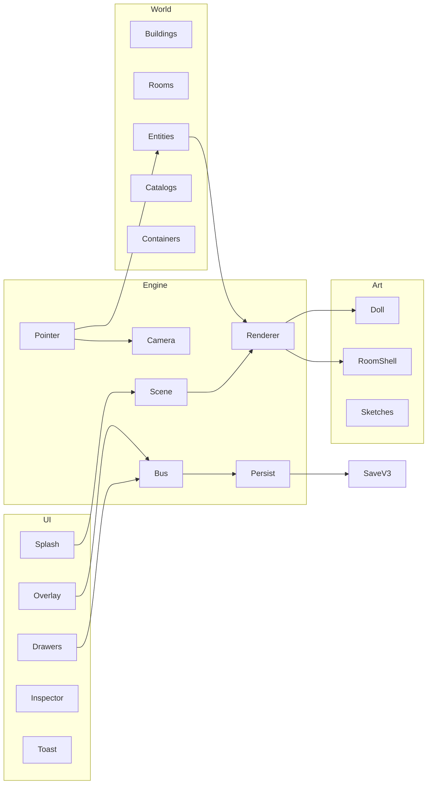
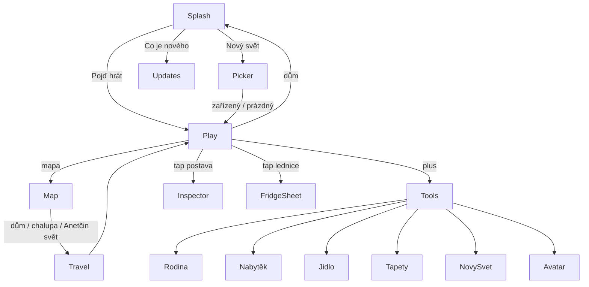
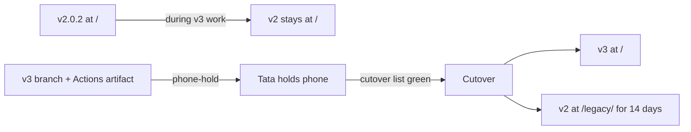

# Toca Groca v3 — Complete Product Redesign

| Field | Value |
| --- | --- |
| **Title** | Toca Groca v3 — Sketchbook House |
| **Author** | Grok (design-doc-writer) |
| **Date** | 2026-08-14 |
| **Revised** | 2026-08-14 (r2 leftovers: cutover roster = PR6a six, two-stage id-map, wall yRel, PR0 `_blocked`) |
| **Status** | Draft |
| **Audience** | Tata Richard + implementing engineers |
| **Supersedes** | Shipped v2.0.2 (2026-06-20) at `D:/GitHub/rv-toca-groca` |
| **In-game language** | Czech (kids) |
| **This document** | English |

---

## Key Decisions

These are the load-bearing choices. Everything else follows from them.

1. **This is not a Toca Boca clone.** Toca Groca is a handmade family dollhouse with a second, irreplaceable destination: the kids' own sketchbook world. Toca cannot ship Anetka's cow family or Klárka's robots. We can. That is why a kid puts the phone down on Toca.
2. **Visual language is "Sešit" (The Sketchbook)** — cream paper, walnut ink, gouache flats, paper-doll construction. Not Nunito-pink kawaii, not Fable/Imagine clipart, not procedural blob people. Rooms are empty illustrated shells. Characters are paper dolls so dress-up and emotions are real.
3. **Two playable worlds, one game.** *Náš dům* + *Chalupa* are Táta's authored picture-book house. *Anetčin svět* is a destination made from the kids' character sheets. Kids' drawings are not a "later pipeline" — they ship as soon as the house is playable, not as a footnote after cutover.
4. **Keep every v2 play promise; throw away the implementation.** Keep: drag, double-tap delete, shirt color, 6 emotions, eat/drink + Czech verb toast, fridge store, 3-level catalog, two houses, 2400 ms plane travel, empty vs furnished, overlay chrome, ZIP backup, "Co je nového", unique family spawn (one Richard). **v3 adds** (not "keep"): sit/sleep poses, wardrobe/toybox containers, pants + extras, avatar creator. Dual SVG+bitmap renderer, `js/game.js` god object, baked furniture, emoji-as-art, coverage-scoring design-loop, English splash, `#FF8FAB` identity go.
5. **TypeScript + Vite, static GitHub Pages, with the Pages footguns named.** Tiny build. Content-hashed assets kill the 1.6.1–1.6.5 cache war. `base` and PWA `scope` are **`/rv-toca-groca/`**. Still no server, no auth, no IAP. **Folders**, not TypeScript, are what would have stopped the 1300-line god object; Vite wins over Alternative F (vanilla ESM + `sync-version.mjs`) on hashed chunks, a real PWA plugin, and typed `migrate.ts` — not on "JS made `game.js`." See Alternatives F and G.
6. **One renderer; flatten-idle is the v3.0 default.** Runtime shows one WebP body + small face overlays, not a 12-`` stack. Live paper-doll layers are a debug flag (`toca-groca-debug=layers`). No runtime SVG character generator in the product look. Painted outfit variants only — no runtime hex-fill of family dolls.
7. **Save v3 migrates v2 in place at cutover only.** Production key stays `toca-groca-save`. Preview / branch builds use **`toca-groca-save-v3-preview`** and never read or write the production key. Same-origin GitHub project Pages (`https://richard004.github.io/rv-toca-groca/`) shares `localStorage` across `/` and any `/v3/` path — so preview is an **Actions artifact** (or a different origin), never a second path on the live host. Migrator converts mixed feet/top `yRel`. Remigrate of a stamped-v2-that-is-really-v3 is a no-op.
8. **Czech-first chrome, almost no pixels.** Portrait 390×844 is the canvas. Scene is the product. Custom 18-icon set, no emoji UI. Splash says *Pojď hrát*, not *Let's Play!* Room arrows (`‹` `›`) are dropped; chip + dots + edge-handoff stay.
9. **Curated furniture, not 130 tinted clones.** Phone-hold / cutover ships **~20** illustrated pieces covering every room type. The full ~48 with extra colorways is 3.0.1, not a PR12 gate. Not `makeVariants()` of the same SVG sofa in four hexes.
10. **Silence by default.** No music loop. Optional paper/wood ticks later. Phones live in bedrooms; night checks happen.
11. **Spoken name stays *Toca Groca*; that is residual trademark risk, not a lock.** In-game kids' name stays. No store listing. No "Toca Boca" in chrome. README/docs do not say "clone." A rename (`Sešit` / `Náš svět`) is ready if a C&D arrives. Not a v3.0 code task — a published-risk task. Open Question 1 remains.
12. **Do not gamify diabetes.** Food is play. Fridge is a toy. No carbs, no scores, no energy bars.
13. **Art production owner.** Tata is art director (identity-sheet accept/reject). Generation is constrained Imagine/Fable against the style bible + negative prompt. No hire in v3.0. **First five refs** (Richard glasses, Anetka chestnut, Puffy ginger, Líza small gray, Cookie large white) are a merge gate for PR6a. Weekly cadence after that. Art is months, not 13 tidy merges.
14. **Family ids are unique; avatars and sketches are not.** Spawning `richard` moves the existing Richard (v2 `spawnEntity` behaviour). Avatars and sketch guests may mint many.
15. **Load one room at a time.** Enter-building does not download five 900 KB shells. Prefetch neighbours after idle. Splash budget is splash JS + 4 dolls, not the 4 MB house.

---

## Overview

Toca Groca v2.0.2 is a working dollhouse that the kids keep leaving. The play is right — drag everyone, feed Anetka a carrot, fly to the cottage, start empty or furnished — but the world looks like two games taped together: leftover blob-SVG dolls sitting on a generic pink "AI kawaii" room that already has a bookshelf and lamp painted in, plus a purple-haired clipart girl who is not Anetka. Dress-up and emotions lie on bitmap characters. Wallpaper tints only the SVG fallback. The design loop scores coverage, not identity. Tata asked for a from-scratch redesign, including visual language, that still feels like it was made by him for Klárka, Anetka, Taníčka and Ríša.

v3 rebuilds the product as **Sketchbook House**: one offline SPA, one renderer, one handmade visual system, three destinations (Náš dům, Chalupa, Anetčin svět). Family members are distinct paper dolls. Rooms are empty shells. Kids' real drawings from `example-drawings/` become playable guests in a sketchbook world that Toca Boca cannot replace. The engine is split into folders so the next voice note does not land in a 1300-line god object. TypeScript types the migrator; folders are what stop the pile-on.

---

## Background & Motivation

### Why this exists

From `prompt.md`: Richard has four diabetic, creative, playful kids. Two play Toca Boca, which is beautiful and expensive. His daughters draw at least as well as Toca art. He wants a free SPA that starts small, grows, persists locally, deploys as a static site, and later absorbs the kids' actual drawings of places, houses, equipment, figures and pets. It should feel like Toca but be *theirs, from him* — funny, about the family, addictive enough that they prefer it to the paid game.

Motto that already exists in the app and must survive:

> Made with ❤️ by Tata Richard for Klarka, Anetka, Tanicka & Risa  
> **Toca Groca — Our Family World**

Czech in-game credit (*Udělal Táta Richard pro Klárku, Anetku, Taníčku a Ríšu*) is **proposed**, not shipped. Today's splash credit is the English line above.

### What shipped (v2.0.2, 2026-06-20)

Vanilla ES-module SPA. Entire playable surface in one day, versions 1.0 → 2.0.2, recorded in `js/updates.js` `SHIPPED_UPDATES`.

Play today:

- Splash → Let's Play / Nový svět (furnished vs empty)
- Immersive room strip, height = viewport, horizontal pan, edge-handoff
- Overlay chrome: room pill, globe, home, dots, + FAB
- Tools: novinky, rodina, nábytek, jídlo, mapa, tapety, fullscreen, nový svět, save, load, aktualizovat
- 2 buildings: Náš dům (living, kitchen, bedroom, bathroom, garden) + Chalupa (cottage-living, cottage-garden)
- World map + ✈️ travel animation
- 12 family/pet characters; 130+ catalog furniture items (3-level picker); 12 foods; emotions; shirt color; feed-by-drag-to-mouth; fridge; double-tap delete; wallpaper presets; localStorage autosave; ZIP backup
- In-app changelog ("Co je nového")

### What actually failed (honour the *asks*, not the *fixes*)

The recurring kid line, still `status: 'ongoing'` in Round 1:

> **Pořád to není jako Toca Boca**

Round-by-round the kids and Tata asked for play. Engineering answered with more features *and* three "visual revolutions" that did not change the identity.

| Round | They asked | What we shipped | What is still true |
| --- | --- | --- | --- |
| 1 | Drag; characters look terrible; pets accurate; Klárka robots; swipe rooms; wallpapers; more houses; clothes; **avatar creator** (unshipped) | Drag + blob SVG "cuter" people + shirt hex | Characters still do not look like this family. Avatar creator never built. Transcript in `feedback/processed/round-1/2026-06-20-14.14.txt`. |
| 2 | Fullscreen / A2HS | `js/fullscreen.js` | Still necessary. Keep. |
| 3 | All furniture types, garden play, bathroom, 3-level picker | 130 procedural variants in `js/catalog.js` | Variants are the same SVG sofa in four hexes. |
| 4 | Emotions, eat/drink, fridge, Czech toast | Works on SVG mouths only | Bitmap characters cannot chew or change face. Food is emoji-in-a-circle (`js/food-catalog.js` `createFoodSVG`). |
| 5 | Empty rooms; everything movable; chrome as overlay | Empty start + overlay | Room *bitmaps* still bake furniture into the background, so "everything is movable" is a lie. Tata: half the screen was toolbars (`feedback/processed/round-5/feed2.txt`). |
| 6 | Pan inside room; world map + plane; edge handoff | Implemented in `js/game.js` | Keep the *feel*. Rewrite the strip rebuild. |
| 6b–6f | Kids cannot get the new version on iPhone | Import-map + meta + CSS href + `version.json` + localStorage `toca-groca-asset-version` + **sessionStorage** `toca-groca-reload-once` + SW unregister | A cache-busting war. History of 1.6.1–1.6.5 is almost only this. |
| 7 | Furnished default *or* empty | `js/default-world.js` | Keep both. Author as data, not 100 lines of magic coordinates. |
| 8–10c | Visual revolution; height = viewport; z-order | Dual renderer + Imagine PNGs | Art is generic stock Toca-like clipart. Files are mislabeled. Mixed styles in one room. |

### Visual evidence (looked at, not paraphrased)

Inspected on 2026-08-14:

- `audit/screenshots/living.png` — leftover procedural SVG dolls (blob people, giant eyes, no identity) sitting on a painted pink room. Giant heart poster. Mixed styles. Overlay is emoji pills.
- `audit/screenshots/kitchen.png` — SVG Richard (a boy with a black eye-mask of "glasses") in a mint cartoon kitchen. Pizza is an emoji circle.
- `audit/screenshots/bathroom.png` — pure SVG primitives. Looks like a wireframe toy, not a place.
- `feedback/out/MOJE-VIZE-obyvak-v2.0.2-room-scroll.png` — painted kawaii living room + Anetka as generic purple-haired "artist girl" + gray cat + overlay chrome. English "STORIES" on a baked book stack.
- `assets/bitmaps/chars/anetka.png` — stock "art kid" with paint-splatter beret and purple hair. Not a 12-year-old Czech girl.
- `assets/bitmaps/chars/richard.png` — waving *boy*, not a dad. No glasses. Wrong age.
- `assets/bitmaps/chars/zuzana.png` — generic clipart mom. Fine as stock; not this family.
- `assets/bitmaps/chars/cookie.png` — **a small gray standing cat**. Cookie is supposed to be a *large white* cat. This file is Líza's brief, misfiled.
- `assets/bitmaps/chars/liza.png` — **a wooden table with books and a vase**. Not a cat. The import map in `scripts/import-bitmaps.mjs` assigned generation batch slots by index and the batch order drifted.
- `assets/bitmaps/rooms/living.png` — pretty, but bookshelf + lamp + rug + family portrait are **baked in**. Placeable sofa/lamp/rug then double up (`js/default-world.js` still spawns `lamp-lamp-0`, `rug-rug-0`, `tv-tv-0`).
- `assets/bitmaps/rooms/kitchen.png` — entire kitchen *set* baked in (stove, sink, fridge, cabinets). "Everything movable" is false.
- `assets/bitmaps/rooms/bedroom.png` — actually a **"Garden Play"** poster with English labels (SAND BOX, BFF, Swing Time!). Wrong file, wrong language, wrong camera.
- `assets/bitmaps/rooms/garden.png` — actually a **purple star bedroom** with two beds baked in.
- `example-drawings/20240331_214106.jpg` — painted purple cat-girl, yellow crescent, real hand, real taste. More interesting than every shipped PNG.
- `example-drawings/20241213_160608.jpg`, `20241213_160642.jpg`, `20241219_190255.jpg` — fashion lineups of duck-people, sheep-people, birds, rabbits, cows. Character sheets. This is how the kids already think about playable worlds.

The game looks like clipart next to their sketchbooks. That is the product problem.

### Architecture pain (cite the code)

- `js/game.js` (~1300 lines) owns layout, pan, drag, catalog, feeding, drawers, rendering, toasts, wallpaper, outfits, travel, persist.
- Dual renderer: procedural SVG (`js/sprites.js`, `js/furniture-sprites.js`, `js/rooms.js`, `js/room-art.js`) + optional bitmap overlay (`js/bitmap-assets.js`). Coverage: 5/12 characters, 4/7 rooms (and 2 of those 4 are the wrong picture), 6 furniture types, 1 toy. Food has no bitmap path (`getFoodBitmap` returns `null`).
- `renderAllEntities()` innerHTML-rebuilds every entity on every change and every resize.
- `buildWorldStrip()` rebuilds the entire strip on every `ResizeObserver` / `visualViewport` event (`setupResizeObserver`, `onLayoutChange`).
- Save schema `js/storage.js` `VERSION = 2` with no migration. `if (!state.version) return getDefaultState()` only fires on missing/0 — **`version: 3` is truthy and loads**. Then `saveState()` always stamps `state.version = VERSION` (2). Rollback threat is **load + stamp + remigrate**, not wipe-on-load.
- `applyWallpaper()` only tints SVG rooms; bitmaps ignore it (`roomSceneSVG` sets `background:${room.floor}` behind an opaque PNG).
- Outfit + emotions only affect `createHumanSVG`. Bitmap characters are flat PNGs (`createBitmapHTML` never calls `getEntityOverrides`).
- `registerCustomAsset()` writes `toca-groca-custom-assets` and is **never read** by the renderer. Ancestor of sketches, not a live pipeline.
- `persist()` does **not** assign `state.worldMode`. It survives only because `startNewWorld` set it on the same object. Easy to drop in a rewrite — SaveV3 writes must include it.
- `scripts/design-loop.mjs` thresholds: `minCoverage: 0.48`, `minMaxHeight: 0.30`. It scores *how full the screen is*, not whether Richard looks like a dad.
- `.github/workflows/deploy.yml` uploads `path: .`. `.gitignore` already excludes `node_modules/` and most inbox voice notes, so the "uploads node_modules" scare is overstated — but `feedback/out/`, `audit/`, and committed bitmaps **do** ship today.
- Mixed English/Czech in `index.html`: "Let's Play!" vs "Nový svět"; `lang="en"`; character drawer title "Our Family & Pets".
- UI is emoji-pill soup, Google Nunito, `--pink: #FF8FAB` everywhere (`css/styles.css` `:root`).
- JSZip loaded from `cdnjs.cloudflare.com` — first-play offline is a lie if the CDN is blocked.
- Nunito loaded from Google Fonts — same.

---

## Goals & Non-Goals

### Goals (v3.0)

- A kid prefers this world to Toca for at least one afternoon because it is *theirs* and it is beautiful.
- Every **v2 play promise** still works, and looks like one world (see Decision 4 for keep vs add).
- Phone-hold family (Richard, Zuzana, Anetka, Puffy, Líza, Cookie) have distinct silhouettes at 390×844. Remaining family by 3.0.1.
- Shirt + 6 emotions + eat mouth are visible on every shipped human. Sit/sleep poses are a v3 add (3.0.1 if art is late).
- Rooms are empty shells; every object is a sprite; double-tap still deletes.
- Anetčin svět ships as a destination with ≥1 sketch room and as many guests as are imported; four guests is the 3.0 *target*, not the cutover gate.
- Czech-first copy. Portrait-first immersive scene. Overlay chrome < 8% of pixels.
- Offline after first load. localStorage + ZIP/JSON backup. No server.
- v2 saves migrate **without jumping yRel**. **Hero furniture + the PR6a family survive as real sprites**; extra garden/bath/cottage SKUs from a furnished v2 house **may become `box-generic` until 3.0.1**. Uids and rooms are never dropped.
- GitHub Pages deploy of a built `dist/` (with `/legacy/` copied in), not the repo root. `base: '/rv-toca-groca/'`.
- Feedback → "Co je nového" loop preserved.
- Path for Tata to add a kid drawing as a playable character in under 15 minutes (CLI in cutover; in-app is 3.1).

### Non-goals (v3.0)

- Backend, accounts, cloud sync, IAP, analytics SDKs, Unity, React Native.
- Cloning Toca **assets**. The existing spoken name *Toca Groca* stays as residual public-site risk (Decision 11), not as a claim of rights.
- Diabetes mechanics, carb counting, "healthy food" scoring.
- 130 furniture SKUs. Color-tint spam is not content.
- Multiplayer, chat, leaderboards, energy, XP, streaks, daily rewards.
- In-app photo capture on first ship (Tata-curated import is enough).
- Sound design beyond a mute-safe silence policy.
- Perfect likeness photography. These are picture-book portraits, not scans of faces.
- Landscape as a first-class composition (supported, not designed-for).
- Rewriting the kids' drawings to "match" the house style. The sketchbook world *is* their style.

---

## Product thesis

**Toca Groca is the family's sketchbook house** — a handmade dollhouse Táta built, and a second door into the worlds the girls already draw.

A kid puts Toca down because Toca will never have *this* Puffy (ginger shiba, fifteen, the real one), *this* Klárka with a robot on the desk, *this* fridge that already has mléko from last night, or the cow-girl in the red dress from Anetka's December sheet walking around a taped-up paper room. The house is cozy and rearrangeable. The sketchbook is infinite and theirs. Together they are a place no store can sell back to them.

---

## Art Direction / Visual Language

This section is the implementation spec for assets and CSS. Visual quality is the #1 complaint. Taste is not optional.

### Style name

**Sešit** — "sketchbook / exercise book."

A Czech family picture-book printed on warm paper, then cut into paper dolls and stood up in a shallow dollhouse. Handmade, slightly imperfect, affectionate, specific. Not a Canva Toca clone. Not "AI slop kawaii."

### North stars (steal structure, never steal assets)

- The kids' own sheets in `example-drawings/`: fashion lineups, full-body turnarounds, one character = one silhouette, clothes as the joke.
- Central-European picture books: gouache, cream paper, walnut line, quiet humour. Think kitchen-table illustration, not app-store illustration.
- Paper dolls and wooden toys: layers you can swap; objects with weight; rooms you can empty.
- Toca Boca *only* for camera grammar (height = viewport, pan, overlay chrome). Not for faces, palette, or marketing sparkle.

### Anti-references (do not generate these)

- Giant wet Toca eyes + circular blush + tiny smile.
- `#FF8FAB` dump, Nunito ExtraBold, sparkle radial-gradients (`css/styles.css` `.splash-sparkles`).
- English baked into art (`Garden Play`, `SAND BOX`, `BFF`, `STORIES`, `ART` on a shirt).
- Standing anthropomorphic *clipart* cats (the current Cookie PNG). Pets in the house world are animals.
- Perfectly even 6px black cartoon outline with plastic cel-shading.
- Rooms with furniture painted in.
- Emoji as the object.

### Palette (tokens, not a dump)

Use these CSS custom properties. Do not introduce a sixth pink.

```css
:root {
  --paper:        #F3EBD9;  /* sketchbook cream */
  --paper-deep:   #E7DCC4;
  --ink:          #2B241C;  /* walnut */
  --ink-soft:     #5A4E42;
  --line:         #3A3128;
  --milk:         #FBF6EC;
  --ochre:        #D4A04A;  /* honey — Ríša, warmth */
  --terracotta:   #C45C3E;  /* accent, FAB, toasts */
  --brick-deep:   #9A3F2A;
  --teal:         #3D7A73;  /* Klárka, map, calm */
  --sage:         #7A9B6A;
  --sky-wash:     #B7C9C4;
  --ginger:       #C86B2A;  /* Puffy */
  --blush:        #D9897A;  /* restrained — cheeks, never UI flood */
  --night:        #2C3340;
  --gold-line:    #C9A15B;
  --shadow:       rgba(43, 36, 28, 0.16);
  --glass:        rgba(251, 246, 236, 0.86);
}
```

**Room tints** (wallpaper) are desaturated washes of the same family, not the old `WALLPAPERS` neon pink/mint/lavender:

| id | name (CS) | wall | floor |
| --- | --- | --- | --- |
| `paper` | Papír | `#F3EBD9` | `#D9C9A8` |
| `clay` | Hlína | `#E7C4B0` | `#C4A484` |
| `pond` | Rybník | `#C5D5CE` | `#8AA396` |
| `plum` | Švestka | `#D5C4D0` | `#9A8494` |
| `night` | Noc | `#3A4250` | `#2C3340` |
| `honey` | Med | `#F0D9A0` | `#C9A15B` |

**v3.0 wallpaper contract (pick one; this is it):**

`wall.webp` is **line + shade + window hole with transparent plaster fill**. CSS `--wall` on the layer *behind* it shows through. A pattern SVG overlay (dots, stripes, floral, none) sits between `--wall` and the line plate. It never tints characters or furniture.

```
.room-wall {
  background-color: var(--wall);
  background-image: var(--wall-pattern); /* optional tiling SVG */
}
.room-wall > img { /* wall.webp */ pointer-events: none; }
```

| Wallpaper id | `--wall` | `--floor` | `shell.windowView` | Garden / cottage-garden | Sketch-studio |
| --- | --- | --- | --- | --- | --- |
| `paper` | `#F3EBD9` | `#D9C9A8` | `window-view-day.webp` | no-op (keep authored sky) | ignore |
| `clay` | `#E7C4B0` | `#C4A484` | `window-view-day.webp` | no-op | ignore |
| `pond` | `#C5D5CE` | `#8AA396` | `window-view-day.webp` | `--sky: #C5D5CE` wash on `sky.webp` | ignore |
| `plum` | `#D5C4D0` | `#9A8494` | `window-view-day.webp` | no-op | ignore |
| `night` | `#3A4250` | `#2C3340` | **`window-view-night.webp`** | `--sky: #2C3340` | ignore |
| `honey` | `#F0D9A0` | `#C9A15B` | `window-view-day.webp` | `--sky` honey wash | ignore |

`content:verify` fails a `wall.webp` whose mean alpha in the plaster sample region (center 30% of the plate, excluding the window hole bbox from `room.json`) is **> 0.18** — that plate is opaque and would lie like v2. Window glass in `wall.webp` must stay α = 0 so `window-view-day.webp` / `window-view-night.webp` shows. `floor.webp` is opaque. Garden / cottage-garden have **no** `wall.webp`; wallpaper is a sky wash or no-op as above.

Do **not** ship six pre-painted wall plates per room in v3.0. Do **not** use `mix-blend-mode` on gouache plates (undefined on window glass).

### Type

Self-host. No Google Fonts on first paint.

| Role | Face | Why | Fallback |
| --- | --- | --- | --- |
| Display (logo, room name, splash) | **Fraunces** 58–72, soft optical size | Bookish, warm, not "kids app." Czech diacritics. | Georgia |
| UI (buttons, drawers, toasts) | **Figtree** 500/700 | Geometric humanist, readable at 12px on a phone, not Nunito. | system-ui |
| Micro (dots, legal, version) | Figtree 500, 11–12px | — | system-ui |

Rules:

- Sentence case in Czech. The copy is already *Vy jste říkali:* (`js/updates.js`). The shout is CSS `text-transform: uppercase` on `.update-you` / `.update-we` in `css/styles.css`. **Fix the CSS**, not the string.
- Fraunces only for 2–6 words. Never body copy.
- Tracking: display −0.02em; UI 0.
- Minimum tap label 12px / 700.

### Character construction

Characters are **paper dolls authored as layers, shipped flattened**. Not flat Imagine PNGs. Not `createHumanSVG()` blobs. **v3.0 family dolls use painted variants only — no runtime hex-fill, no multiply-on-gray for house family.**

#### Runtime vs authoring (one pose system)

**Runtime default (flatten-idle):** each human on screen is at most **three** ``s:

1. `poses[pose][outfitId].src` — one flattened body+clothes WebP
2. `face.eyes[emotion]` — small overlay, same box
3. `face.mouth[emotion | 'eating']` — small overlay

`idle.webp` **is** that flatten cache for the default outfit + idle pose. It is not a second competing stack. `doll.ts` may rebuild flatten caches offline (`npm run art:flatten`) from the authoring layers; the playable game does not composite 12 full-size images.

**Authoring layers** (for flatten + for `toca-groca-debug=layers`) live in `content/characters/<id>/layers/`, z-ordered bottom → top:

```
shadow.webp          # z=0
hair-back.webp       # z=10  (behind head — listed first on purpose)
body.webp            # z=20
pants-<id>.webp      # z=30
shirt-<id>.webp      # z=40
head.webp            # z=50
hair-front.webp      # z=60
extras-<id>.webp     # z=70  glasses / robot pin / sketchbook
eyes-<emotion>.webp  # z=80
mouth-<emotion>.webp # z=90  includes mouth-eating
```

**One pose mechanism:** `showIn` on each authoring layer. No `sit-mask.json` / `sleep-mask.json`. Sit/sleep in v3.0.1 are extra flattened files (`poses.sit.default`, `poses.sleep.default`) for the default outfit only.

```ts
interface SpriteLayer {
  id: string;
  src: string;
  z: number;
  showIn: Array<'idle' | 'sit' | 'sleep' | 'eat'>;
  // no recolor on family dolls
}

interface FaceOverlays {
  eyes: Record<Emotion, string>;
  mouth: Record<Emotion | 'eating', string>;
}

interface PoseOutfit {
  outfitId: string;          // 'default' | 'shirt-teal' | …
  src: string;               // flattened WebP
}

interface CharacterDef {
  id: string;
  name: string;
  role: string;
  kind: 'human' | 'dog' | 'cat' | 'rabbit' | 'sketch';
  heightRel: number;
  mouth: { x: number; y: number };
  sitAnchor: { x: number; y: number };
  outfits: { id: string; name: string; src: string }[];  // painted full-body idles
  faces: FaceOverlays;
  poses: {
    idle: PoseOutfit[];
    sit?: PoseOutfit[];      // 3.0.1
    sleep?: PoseOutfit[];    // 3.0.1
  };
  extras: string[];
  layers?: SpriteLayer[];    // authoring / debug only
  identity: IdentityNotes;
}
```

Phone-hold outfit set per human: **default + 2 painted shirts** (3 flattened idles) and 6 eye + 7 mouth overlays (happy/sad/angry/surprised/sleepy/love + eating). Pants stay the default paint until 3.0.1.

Pets are **not** paper-doll humans. One flattened body + one face overlay at 512×512, breed-accurate, sitting or standing on four legs. Emotion is a face swap, not an emoji bubble (`petEmotionBubble` is deleted).

`AvatarRig` / `SketchRecord` are defined in the Implementer Appendix. Avatar is the **only** multiply-mask pipeline (grayscale hair × `{h,s,l}`), and it is **not** on the cutover path.

#### Proportions

| Who | Heads tall | `heightRel` | Notes |
| --- | --- | --- | --- |
| Richard | 5.0 | 0.38 | Adult. Shoulders. Glasses are part of the silhouette. |
| Zuzana | 5.0 | 0.36 | Adult. Distinct hair mass. |
| Klárka | 5.0 | 0.36 | Adult-young. Longest legs. Robot pin. |
| Anetka | 4.2 | 0.30 | 12. Sketchbook or pencil as extra. Chestnut hair, **not purple**. |
| Taníčka | 4.1 | 0.29 | 11. Must not be a recolor of Anetka. Different hair cut. |
| Ríša | 3.4 | 0.24 | 6. Bigger head, shorter legs, honey shirt. |
| Dart | — | 0.20 | Large standard poodle, white pompons, taller than Puffy. |
| Puffy | — | 0.17 | Ginger shiba, cream belly, curled tail, black mask. |
| Cookie | — | 0.16 | **Large** white cat, loaf or sit, fluffy chest. |
| Berta | — | 0.15 | Large rabbit. **Change, not a keep:** v2 `CHAR_HEIGHT_REL` has no `berta` (she would get generic 0.36 if bitmapped). |
| Líza | — | 0.11 | **Small** gray cat. Half Cookie's visual mass. |
| Mikie | — | 0.10 | Small rabbit. |

On a 844 px room, Richard is ~321 px tall, Líza ~93 px. That is the scale the living-room screenshot already reached (`audit/report.json` `maxHeightRatio ≈ 0.49`) — keep the *size*, fix the *drawing*.

#### Line, fill, face grammar

- **Line:** walnut `--line`, slightly pressure-sensitive, not a uniform 6 px sticker stroke. Corners can overshoot 1–2 px. No pure `#000`.
- **Fill:** two values per shape (local color + one cooler shade). One highlight max. No plastic gradient, no rim light, no sparkle dots.
- **Faces:** eyes are almonds, ~1/6 of head width, with a readable iris color. Mouths are small. Cheeks are a *wash*, not a pink circle sticker.
- **Hands:** mitten or three-finger. No realistic anatomy.
- **Hair:** silhouette first. Anetka's hair is a chestnut wedge or two-braid — a shape you can spot at 64 px. Not a purple paint explosion.
- **No name labels baked into the sprite.** The current `.entity-label` ("Zuzana") appears on hover/select only, set in CSS, Fraunces 11 px on a paper chip.

#### Identity sheets (must be true in the art)

These are acceptance criteria, not flavour.

| id | Must read as | Must never read as |
| --- | --- | --- |
| `richard` | Dad. Glasses. Adult jaw. Taller than the girls. Knit or open shirt, not a school-boy polo. | The current waving boy PNG. A teenager. A blob with a black eye-mask. |
| `zuzana` | Maminka. Warm, adult, brown hair with real volume. Soft sweater. | Generic pink clipart girl. |
| `klarka` | 21. Most "grown" of the kids. Robot pin or small robot extra. Hoodie or work shirt. Can sit at a desk and look like she is building. | A third copy of Anetka. |
| `anetka` | 12-year-old Czech girl who draws. Sketchbook or pencil. Chestnut/brown hair. Freckles optional. | Purple-haired stock "artist kid" (`anetka.png`). |
| `tanicka` | 11. Distinct hair (bob or clips). Different shirt language than Anetka (teal/plum, not paint-splatter). | Anetka minus 2 cm. |
| `risa` | 6. Small. Honey/ochre. Energy. | A scaled-down Richard. |
| `puffy` | Ginger shiba. Cream belly. Curled tail. 15 years old in the *face* (not a puppy, not a fox). | Generic orange dog. |
| `dart` | Large white standard poodle. Pompons. Taller, fluffier than Puffy. | A white cloud, a lamb, a small dog. |
| `liza` | Small gray cat. Cat-shaped. | A standing person-cat. The current table PNG. |
| `cookie` | Large white cat. Clearly bigger than Líza. | A gray cat. A small kitten. |
| `berta` | Large rabbit. | A dog. |
| `mikie` | Small rabbit. Clearly smaller than Berta. | A copy of Berta. |

**Klárka's robot** is a separate toy (`toy-robot`) plus a pin extra on her shirt. She does not have a robot glued to her SVG hip (`createHumanSVG` `features.robotics` hack).

#### Sketchbook characters (Anetčin svět)

Kids' drawings are mounted, not redrawn:

1. Photo / scan, background removed to alpha.
2. Wrapped in a **paper card**: 12 px cream mat, two washi-tape corners, 1 px walnut hairline.
3. Playable as `kind: 'sketch'`. Drag, feed (mouth estimated at 40% from top), double-tap delete. No dress-up unless Tata later slices the drawing.
4. The card treatment is the contract that lets two styles share a screen: house dolls and sketch guests never pretend to be the same medium.

v3.0 guests (from `example-drawings/`):

| id | source | name (CS) |
| --- | --- | --- |
| `sketch-catgirl` | `20240331_214106.jpg` | Kočičí dívka |
| `sketch-cow-red` | `20241219_190255.jpg` (red dress) | Kraví slečna |
| `sketch-duck-blue` | `20241213_160608.jpg` (blue dress) | Kachna v modrém |
| `sketch-rabbit-pink` | `20241213_160642.jpg` (pink top) | Králíček |

### Room construction

A room is an **empty illustrated shell**. If you can sit on it, eat from it, or throw it away, it is *not* in the background.

#### Layers (back → front)

```
room/
  sky.webp          # exterior through window, or garden sky
  wall.webp         # far + side walls, baseboard, architectural window hole
  window-view-day.webp    # trees / sun — default shell.windowView
  window-view-night.webp  # night wallpaper only
  window-frame.webp # frame + curtains + sill. Curtains are architecture.
  floor.webp        # planks / tiles / grass. No rugs.
  light.webp        # multiply/screen wash, 20% opacity
```

Plus a **pattern overlay** (CSS mask or tiling SVG) driven by wallpaper: dots, thin stripes, faint floral, none.

**Forbidden in the shell:** sofas, lamps, TVs, bookshelves, beds, fridges, stoves, rugs, toys, English posters, family portraits, "Garden Play" logos, baked trees that the catalog also sells.

Garden and cottage-garden shells may include a *horizon, fence, and sky*. Trees, swings, pools, doghouses are sprites.

#### Camera

v3 rooms are **wide Toca pans**, not the 3:4 Imagine plates (780×1040, aspect 0.75) and not Round 9's "celá místnost viditelná" portrait. On a 390 px phone the kid sees ~29% of a 1.6 room (pan ≈ 960 px). That is a **play-feel change**, called on purpose: Round 6 asked for Toca-style in-room pan; Round 9 then shrank the room to fit. We take Round 6 / 10c. If kids say the room *zmizela*, drop authored aspect to **1.35** (still wider than viewport; Open Question 8).

- Authored **2560 × 1600 px** (aspect **1.6**).
- Runtime: `innerH = viewportH`; `innerW = max(viewportH * 1.6, viewportW * 1.45)`.
- Bitmap drawn at height = `innerH`, width = `innerH * 1.6`, left-aligned in the inner. Extra inner width (if any) is paper-colored padding, never a stretch.
- Portrait 390×844 → inner ≈ 1350×844. Pan range ≈ 960 px.
- Landscape 844×390 → innerH = 390, artW = 624. Art is narrower than viewport: **center it on `--paper`, never crop height.**
- No vertical scroll. Ever. (`overflow-y: hidden` stays.)
- Horizon / floor line sits at **62% of room height** (matches current `createRoomSVG` floor at `h * 0.62` — keep this; kids already know where the floor is).
- Wall items (TV, poster, mirror, clock) snap to yRel ∈ [0.08, 0.36].
- Floor items use **feet anchoring** (`yRel` = feet) for **every** v3 entity. v2 did this only on the bitmap path (`bitmapEntitySize.anchorBottom`); SVG stored top-of-box. Migration must convert (see Data Model → yRel).

#### Depth / z-order

```
wall decor     = 100 + yPx
rugs           = 200 + yPx
floor furniture= 300 + feetPx
characters     = 400 + feetPx
tabletop/food  = 500 + feetPx
held / dragging= 9000
chrome         = 10000
```

This replaces both `Math.round(pos.y + size.h)` and `bitmapEntityZIndex`. One function.

#### Per-room identity (v3.0 shells)

| id | wall | floor | window / exterior | special architecture |
| --- | --- | --- | --- | --- |
| `living` | cream plaster, faint ochre wash | oak planks | large 6-pane, garden trees | picture rail (empty). No heart poster. |
| `kitchen` | sage plaster | honey tiles | small high window, sky | open shelf *brackets* only (no dishes). Tile splashback. |
| `bedroom` | plum wash | pine | night-or-day window | two empty alcoves where beds *may* go. No beds. |
| `bathroom` | milk tile grid (drawn, not furniture) | cool stone | frosted window | towel hook *bar* empty. No toilet/van. |
| `garden` | — (sky + hedge) | grass + dirt path | sky, fence, distant cottage roof | no play equipment. |
| `cottage-living` | timber wash, one beam | wide boards | small cottage window | wood stove *niche* (the stove itself is a sprite). |
| `cottage-garden` | — | meadow | trees, hills | fence. |
| `sketch-studio` | taped kraft paper | paper + washi scraps | a "window" that is a drawing of a window | binder clips, tape rolls as architecture. |

### Chrome / iconography

Replace every emoji in chrome with a **custom 24×24 SVG icon set**, 1.75 px walnut stroke, rounded caps, no fill except the FAB.

Required icons (18):

`play`, `new-world`, `home`, `map`, `plus`, `close`, `back`, `room`, `family`, `furniture`, `food`, `news`, `wallpaper`, `fullscreen`, `save`, `load`, `refresh`, `plane`

Drawn once in `src/art/icons/`. Referenced as `<i data-icon="map">` with a CSS mask. No emoji in `index.html` chrome, tools grid, or splash.

Emoji may appear **inside kids' drawings** and **inside toast flavour** only if the toast also has a text verb. Prefer no emoji in toasts: *Anetka snědla mrkev.* is enough (Round 4 already asked for this sentence).

Overlay layout (keep the v2 *positions*, restyle):

```
[ room chip ]                    [ map ] [ home ]
              (scene)
[ · · ● · · ]                          [ + ]
```

- Room chip: Fraunces 15 / Figtree 700, `--glass`, 1 px `--paper-deep` border, 999 px radius, icon + name + chevron. No sofa emoji.
- Map / home: 40×40 circles, glass, ink icons.
- Dots: 6×6, active = terracotta pill 14×6.
- FAB: 56×56 terracotta, white plus, shadow `--shadow`. Not a pink gradient.
- Character inspector (was `character-bars`): a **bottom sheet 96 px**, glass, two rows — emotions as face thumbnails (not emoji), outfits as shirt swatches printed on paper chips.
- Hint text under the scene is removed. Teach once via Co je nového + first-run toast.
- **Room arrows (`#arrow-left` / `#arrow-right`) are dropped.** They are not in the overlay wireframe and they blow the 4.7% budget. Navigation is room chip + dots + edge-handoff + map. Do not restyle them; delete them.

### Motion principles

| Action | Motion |
| --- | --- |
| Drawer open | 220 ms ease-out, translateY(8%) → 0, fade. |
| Room switch | horizontal scroll, 280 ms `cubic-bezier(.22,.8,.28,1)`. |
| Pan | 1:1 finger, no inertia past edges; edge-handoff as today. |
| Pick up entity | scale 1.04, shadow up, 120 ms. |
| Drop | scale 1, 140 ms spring. |
| Spawn | 180 ms from 0.85 → 1, fade. |
| Delete | 160 ms shrink + fade. No sparkles. |
| Eat | mouth layer swap 2.2 s (keep `eatingUntil` timing). |
| Sit / sleep | 200 ms crossfade to pose stack + snap to furniture sitAnchor. |
| Travel | 2.4 s paper-plane over a drawn map, not ✈️ emoji. Keep duration from `js/world-map.js`. |
| Splash | no bounce-forever logo. One 600 ms rise. Characters idle-breathe 3 s, 2 px. |

**Do not:** infinite sparkle, wiggle-all, bounce-logo (`css/styles.css` `.logo-bounce`, `.splash-sparkles`). Those read as generic kids-app.

### Sound

**Silence is the design.** No autoplay, no loop.

v3.1 may add: drawer paper-slide (~80 ms), drop wood-tick, plane whoosh — all under a single *Zvuky* toggle, default off. Never voice acting of the kids.

### Do / Don't (style bible card)

**Do**

- Draw on cream. Leave a little paper showing in highlights.
- Give every human a silhouette you can name in one second.
- Put identity in extras (glasses, sketchbook, robot pin), not in a caption.
- Keep rooms empty enough that a kid can *ruin* them.
- Mount kids' art on washi cards.
- Write Czech as a family talks: *Pojď hrát. Letíme na chalupu. Cookie je v lednici — ne, to je mléko.*

**Don't**

- Generate "Toca-style kawaii girl, purple hair, paint splatter."
- Bake a sofa into a living room.
- Use emoji as a chair.
- Recolor one body into six family members.
- Put English on a Czech child's wall.
- Mix blob-SVG and painted PNG in one room.
- Score beauty as "48% of the grid is covered."

#### Imagine / Fable prompt contract

Every generation call prepends this. Reject any output that violates it — do not import.

**Positive:** Czech family picture-book paper doll, cream paper `#F3EBD9`, walnut ink line ~3px, gouache flats with one cooler shade, slightly imperfect corners, empty room shell OR single object on transparent, portrait doll 512×896, adult dad with glasses / 12yo chestnut-haired girl / ginger shiba / small gray quadruped cat / large white fluffy cat.

**Negative prompt (mandatory):**

```
toca boca, kawaii sticker, chibi, giant wet eyes, circular blush sticker,
purple hair, rainbow beret, "ART" on shirt, paint splatter clothes,
waving schoolboy, standing biped cat, anthropomorphic clipart pet,
black 6px even outline, cel shading, rim light, sparkles, glitter,
English text, Garden Play, SAND BOX, BFF, STORIES, ABC books,
baked sofa, baked lamp, baked fridge, baked bed, furniture in background,
emoji, Nunito, hot pink #FF8FAB, stock vector kid, Canva, cute master,
extra fingers, photoreal, 3D render, plastic toy
```

#### First-five refs (merge gate for PR6a)

Produce and Tata-approve `content/characters/<id>/ref.png` (256 px tall, idle, default outfit) **before** PR6a merge, in this order:

1. `richard` — adult, glasses  
2. `anetka` — 12, chestnut, not purple  
3. `puffy` — ginger shiba, cream belly  
4. `liza` — small gray cat, not a table, not standing  
5. `cookie` — large white cat, bigger than Líza  

`identity.sheet` QA is "file exists + human checklist," not a Hamming number. Without these five files, PR6a does not merge.

### Asset pipeline

#### How a new furniture piece gets into the game

1. Draw at **1024 px** on the long side, WebP, clean alpha, walnut outline, no drop shadow in the file (CSS drop-shadow is applied).
2. Save as `content/furniture/<type>/<id>.webp`.
3. Add one row to `content/catalog/furniture.json` (`id`, `type`, `group`, `name`, `size`, `anchors`, `colorways[]`).
4. Optional colorways are **painted**, or a single multiply layer `colorway.webp`. No runtime hex-fill of a gray cube.
5. `npm run content:verify` checks: alpha not empty, no English OCR, bounding box > 10% of canvas, manifest hash updated.
6. Catalog picker shows the WebP. Spawn uses the same file.

#### How a new character gets into the game

1. Identity sheet approved (table above).
2. Layer pack in `content/characters/<id>/` + `character.json`.
3. Register in `content/characters/index.json`.
4. Appear in Rodina drawer automatically.

#### How a kid drawing becomes a playable character

**v3.0 (Tata-curated, 15 minutes):**

1. Photo the page (existing `example-drawings/` workflow).
2. `npm run art:import-sketch -- --src path.jpg --id sketch-cow-red --name "Kraví slečna"`
3. Script: downsample long side to 1024, flood-fill background from corners (reuse the *idea* of `scripts/import-bitmaps.mjs`, but write a new script — the old `MAP` by generation index is how `liza.png` became a table), trim, wrap with the paper-card SVG, write `content/sketches/<id>.webp` + JSON.
4. Character appears in Anetčin svět → Rodina → *Kresby*.

**v3.1:** in-app *Přidat kresbu* in tools, file input, same pipeline in WASM/canvas, stored in the save ZIP under `sketches/`.

`registerCustomAsset` in `game.js` is the ancestor of this. Replace it with `src/art/sketches.ts`.

#### Target resolutions

| Asset | Size | Format |
| --- | --- | --- |
| Room layer | 2560×1600 | WebP q=82 |
| Human layer | 512×896 | WebP lossless if < 80 KB else q=90 |
| Pet | 512×512 | WebP |
| Furniture | 1024 long side | WebP |
| Food | 384×384 | WebP |
| Icon | 24×24 / 48×48 | SVG |
| Sketch guest | 1024 long side + card | WebP |
| App icon | 512 SVG + 192/512 PNG | for A2HS |

Transparency: straight alpha, no matte halo. Verify with a magenta checker in `content:verify`. The current Anetka PNG halo is a ship-blocker if it reappears.

#### Naming

```
content/
  characters/richard/character.json
  characters/richard/shirt-knit.webp
  furniture/sofa/sofa-clay.webp
  furniture/fridge/fridge-milk.webp
  food/food-carrot.webp
  rooms/living/wall.webp
  rooms/living/floor.webp
  sketches/sketch-catgirl.webp
  icons/map.svg
  worlds/furnished.json
  worlds/empty.json
  copy/cs.json
```

IDs are stable and kebab-case. Catalog IDs from v2 (`sofa-sofa-0`, `food-carrot`) are listed in `src/save/id-map.ts` for migration.

---

## Play Model

### What kind of game this is

A **toy**. Not a game. No scores, lives, energy, coins, IAP, timed events, "come back tomorrow." The addiction is dollhouse + dress-up + feeding + travel + "my drawing is in here."

### Core loops

1. **Dollhouse** — spawn, drag, layer, delete, wallpaper. The v2 loop. Keep.
2. **Care** — drag food to mouth; fridge stores food; bath is pretend (toast). Sit/sleep poses are a v3 add.
3. **Dress & feel** — tap a human → inspector: **shirt** (v2 keep) + emotion. **Pants + extras are a v3 add** (3.0.1 if late). Visible on the doll via painted variants, not hex.
4. **Travel** — map → paper plane → other building. Edge-pan still walks to the next room *inside* a building.
5. **Discover** — furnished world is a gift from Táta; empty world is a blank sešit. Both are the same toy.
6. **Create** — Anetčin svět + Tata-curated sketch import. **Avatar creator is a v3 add**, not a cutover gate (Round 1 unshipped; PR11 optional).

### Interaction grammar

One pointer. No multi-touch gestures except the browser's own pinch (disabled via `touch-action` on the scene).

| Gesture | Target | Result |
| --- | --- | --- |
| Press + move > 6 px | entity | drag (threshold already in `onEntityPointerMove`) |
| Press + move | empty floor | pan room X |
| Pan past edge | room | handoff to neighbour room (keep `onPanPointerMove`) |
| Tap | entity | select; show inspector if character; furniture reacts if a character is already selected |
| Double-tap < 400 ms | entity | delete (keep `lastTapTime` behaviour) |
| Tap | empty | deselect |
| Drag food to mouth (58 px hit, keep) | character | eat |
| Drag food to fridge (0.14 rel, keep) | fridge | store |
| Tap fridge | fridge | open container sheet |
| Tap wardrobe / toybox | container | open container sheet |
| Drop character on sofa/chair/bed | furniture | **v3 add:** snap-sit / sleep if sit-hit (Appendix) |
| Tap + | chrome | tools |
| Tap room chip | chrome | room picker |
| Tap map | chrome | destinations |
| Tap home | chrome | splash (state stays saved) |

**Pan vs drag** is hit-tested: entities win. Furniture in the *shell* does not exist, so the old `.furniture.interactive` baked-SVG path dies.

### Containers

v2 fridge is a list in `fridgeItems[roomId]` plus a proximity check. **Fridge is a keep.** Wardrobe and toybox are **v3 adds** (ship with thin PR7 only as fridge; wardrobe/toybox in 3.0.1).

v3 fridge stays first-class:

```ts
interface Container {
  entityUid: string;
  type: 'fridge' | 'wardrobe' | 'toybox';
  accepts: Array<'food' | 'item' | 'outfit'>;
  items: Array<{ id: string; at: number }>;
  capacity: number; // fridge 12, toybox 16, wardrobe 12
}
```

Open = bottom sheet showing stored things as drag sources. Close on backdrop. Fridge still accepts a drop without opening (keep the "I tossed the milk in" joy).

Wardrobe stores *outfit pieces* and is how the avatar creator's clothes re-enter the house. Toybox stores toys. A character cannot be stored.

### Poses

| Pose | Status | Trigger | Visual |
| --- | --- | --- | --- |
| idle | keep | default | flattened idle WebP + face overlays |
| eat | keep | food to mouth | `mouth-eating` 2.2 s (`eatingUntil`), then happy |
| held | keep | dragging | scale 1.04, no new art |
| sit | **v3 add** | drop on sofa/chair/bench/toilet | flattened sit, snap to furniture `sitSocket` (Appendix) |
| sleep | **v3 add** | drop on bed | flattened sleep, eyes sleepy |

Pets: idle + face. Curl-sleep is 3.0.1.

v2 furniture tap only toasts (`reactToFurniture` / `FURNITURE_REACTIONS`). Port that table into `content/copy/cs.json` as data (full verb list, not just eat). Sit/sleep do **not** replace the toast — they add a pose.

### Family uniqueness

Spawning a family id (`richard`…`mikie`) **moves** the existing entity into the current room (v2 `spawnEntity`). Avatars (`id` starts with `avatar-`) and sketches mint new uids. Never 10 Anetkas from the Rodina drawer.

### Avatar creator (v3 add — not on the cutover path)

Unshipped Round 1 ask, quoted:

> tělo barvu těla vlasy oči uši pusa nos oblečení náušnice barvu očí … věci které se prostě běžně volej když si člověk vytváří nového Avatara

When it ships (PR11 / 3.0.1), it uses painted `_parts` (24 files; hair color = multiply on a grayscale mask — the only multiply pipeline). It is **not** required for cutover. Phone-hold does not include it.

Entry: tools → *Nová postava* only. Not a Nový svět card (that picker only resets the house). Lives in the current room after save.

v3.0 knobs:

- Body: child / teen / adult (3)
- Skin: 5
- Hair style: 6 + hair color: 8
- Eyes: 4 shapes + 6 colors
- Brows: 3
- Mouth: 4
- Shirt: 8 + pants: 6
- Glasses: on/off
- Earrings: on/off

v3.1 knobs: ears (human + animal, for sketchbook crossovers), nose, full clothing catalog, save as reusable template.

Created characters persist as `kind: 'human'`, `id: 'avatar-<uid>'`, and `rig: AvatarRig`. No `defId` field. They appear in Rodina under *Naše postavy*.

### What is not a game

No: points, stars, "level 2 kitchen", hunger meters, diabetes mode, ads, timers that punish, loot boxes, season passes, "invite a friend."

Toasts are flavour, not rewards. *Anetka snědla mrkev.* is a story beat.

---

## Proposed Design (Architecture)

### Decision: TypeScript + Vite (with Pages footguns named)

**What actually caused the pain**

- `js/game.js` is 1300 lines because **nothing was in folders**. TypeScript would not have stopped a 1300-line `scene.ts`. Alternative F (vanilla ESM + the existing `scripts/sync-version.mjs`) would also kill the god object if we split the tree.
- The cache war is real: import map + `meta toca-version` + CSS `?v=` + `manifest.start_url` + `version.json` + localStorage `toca-groca-asset-version` + **sessionStorage** `toca-groca-reload-once` + SW unregister (`index.html` 52–55). `sync-version.mjs` already exists as a zero-bundler fingerprint.

**Why Vite still wins over F** (honest, not "JS made game.js")

| | Vite + TS (chosen) | F: vanilla ESM + sync-version |
| --- | --- | --- |
| Cache | Content-hashed chunks; no handmade import map | Works; one version string stamped in many files (today's war surface) |
| PWA | `vite-plugin-pwa` with `base`/`scope` | Hand-rolled SW; easy to get scope wrong |
| Types | `migrate.ts` / SaveV3 are the most dangerous code | JSDoc optional |
| Code-split | splash vs play vs avatar | Manual dynamic `import()` |
| Tata play today | `npm run dev` / `npm run preview` — **not** `serve .` | `npx serve .` still works |
| Pages `base` | **Must set `base: '/rv-toca-groca/'`** or every hashed asset 404s | No `base` footgun |
| Dual HTML until cutover | `index.html` stays v2; Vite root is `v3/index.html` | One HTML |
| `"type": "module"` | Keep repo `"type": "commonjs"` for leftover scripts; Vite ESM is the `src/` tree only | No switch |
| CI | Node already required (`puppeteer`, `sharp`) | Same |

**Pages / PWA contract (non-negotiable if Vite stays)**

```ts
// vite.config.ts
export default defineConfig({
  base: '/rv-toca-groca/',
  plugins: [VitePWA({
    base: '/rv-toca-groca/',
    scope: '/rv-toca-groca/',
    registerType: 'prompt',
  })],
});
```

- Dual HTML until PR12: repo-root `index.html` is **v2** (`npm start` = `npx serve .`). v3 entry is `v3/index.html` (Vite `root` or `publicDir` arrangement documented in PR1). Tata plays v2 with `serve .`; agents play v3 with `npm run dev`.
- `npm run build` emits `dist/` **and** copies a tagged **v2.0.2 snapshot** into `dist/legacy/`. Uploading `dist` alone would delete v2 from Pages.
- Preview is an **Actions artifact** (download + `vite preview`) or a **different origin**. Never publish a `/v3/` path on `richard004.github.io/rv-toca-groca/` — that origin shares `localStorage` with the kids' live game.
- Stop unregistering SW in v3 boot. Hashed assets make a good SW safe.

**Why not React / Vue**

Extra runtime, extra "kids app" temptation to componentize chrome until the scene is 40% UI. The scene is DOM + CSS. Keep it. (Alternative G: canvas vs DOM — DOM wins for hit-testing, CSS drop-shadow, and accessible drawers.)

### Target tree

```
src/
  main.ts                 # boot
  app/
    routes.ts             # splash | play
    version.ts            # injected at build
    pwa.ts
  engine/
    bus.ts                # tiny event bus
    scene.ts              # room strip + current building
    camera.ts             # pan, size, resize (no strip rebuild)
    pointer.ts            # drag vs pan vs tap vs double-tap
    renderer.ts           # patch the DOM, never innerHTML the world
    persist.ts            # debounce save on events
  world/
    types.ts
    buildings.ts
    rooms.ts
    entities.ts
    containers.ts
    catalogs.ts
    default-world.ts      # loads JSON
    travel.ts
  play/
    feed.ts
    dress.ts
    poses.ts
    reactions.ts          # Czech flavour, data-driven
    avatar.ts
  art/
    doll.ts               # flatten-idle + face overlays; layers if debug
    room-shell.ts
    sketches.ts
    icons.ts
  ui/
    splash.ts
    overlay.ts
    drawers.ts
    inspector.ts          # clothes + emotions
    catalog-picker.ts     # 3-level, kept
    map.ts
    toast.ts
    updates.ts
    fullscreen.ts
    copy.ts               # cs.json accessors
  save/
    schema.ts
    migrate.ts            # v1/v2 → v3
    storage.ts
    zip.ts
  styles/
    tokens.css
    base.css
    chrome.css
    scene.css
content/                  # art + world data (see Art Direction)
public/
  icons/
  manifest.webmanifest
v3/index.html             # Vite entry, lang="cs" (until PR12)
index.html                # v2, untouched until cutover
```

Legacy `js/*.js`, `css/styles.css`, `assets/bitmaps/**` stay at repo root so `npx serve .` still plays v2. Deleted from the **deployed root** only at PR12, after they are copied to `dist/legacy/`.

### Runtime split



### Scene / camera / entity / interaction

**Scene** owns: current building, ordered room ids, which room is active, travel lock. It does *not* own pointer math.

**Camera** owns: viewport size, per-room `panRel` (0–1), `innerW/innerH`, converting clientX/Y ↔ xRel/yRel. Resize updates CSS variables and entity pixel positions. It does **not** call `buildWorldStrip()`. Rooms are created once per building enter.

**Entity store** is a `Map<uid, Entity>`. Mutations emit `entities:changed` with a dirty set. Renderer patches those nodes.

**Pointer** is a state machine. Lingering modes are only `idle | pending | drag | pan`. `tap` and `doubleTap` are **exit events**, not modes.

```
idle --pointerdown--> pending
pending --move > 6px, on entity--> drag
pending --move > 6px, on floor--> pan
pending --pointerup, same uid < 400ms--> emit doubleTap, idle
pending --pointerup--> emit tap, idle
drag|pan --pointerup--> idle
```

Threshold 6 px, double-tap 400 ms — keep the numbers kids already have in their fingers.

**Renderer**

- Room shell: 6 `` layers + wallpaper CSS.
- Entity: a `.entity` positioned absolutely; children are layer ``s or a single sketch card.
- Selection ring is CSS, not a yellow drop-shadow soup.
- No `innerHTML` of the layer on drag. Drag writes `transform: translate3d()`; on drop, commit left/top and persist.

This kills the two hottest jank sources in v2: strip rebuild + full entity innerHTML.

### Evented persist

```ts
type GameEvent =
  | { type: 'entity:moved'; uid: string }
  | { type: 'entity:spawned'; uid: string }
  | { type: 'entity:removed'; uid: string }
  | { type: 'entity:dressed'; uid: string }
  | { type: 'entity:emotion'; uid: string }
  | { type: 'entity:posed'; uid: string }
  | { type: 'food:eaten'; uid: string; by: string }
  | { type: 'container:changed'; uid: string }
  | { type: 'room:changed'; roomId: string }
  | { type: 'room:panned'; roomId: string }
  | { type: 'building:changed'; buildingId: string }
  | { type: 'wallpaper:changed'; roomId: string }
  | { type: 'world:reset'; mode: 'empty' | 'furnished' }
  | { type: 'world:mode'; mode: 'empty' | 'furnished' | 'custom' }
  | { type: 'avatar:created'; uid: string }
  | { type: 'sketch:imported'; id: string };
```

`persist.ts` listens, debounces 400 ms (plus the existing 10 s safety interval), writes SaveV3 **including `worldMode`**.

`worldMode` transition: `'furnished'` or `'empty'` until the first `entity:moved | entity:spawned | entity:removed | entity:dressed | wallpaper:changed` after that start → `'custom'`. Reset via Nový svět sets `'empty'` or `'furnished'` again.

### Catalogs

Three JSON catalogs, one picker component.

- `content/catalog/furniture.json` — groups → subgroups → items (keep the 3-level UX from Round 3; it was a real ask).
- `content/catalog/food.json` — flat list, 12+ items.
- `content/catalog/family.json` — family + pets + sketches + avatars.

Picker UI is Czech, icons from the custom set, **preview is the real WebP** (today level 3 shows `createPlaceableSVG`; level 1–2 are emoji cards).

### Default furnished world

`content/worlds/furnished.json` is data. No `uid('f')` helpers with hidden counters (`js/default-world.js`).

Each entity: `{ id, kind, catalogId, room, xRel, yRel, emotion?, outfit?, pose? }`.

Author in a tiny `npm run world:edit` later if needed; v3.0 is hand-editable JSON. Coordinates are relative, so they survive phone sizes.

Empty world: `{ entities: [], containers: [], roomThemes: {}, worldMode: "empty" }`.

### Critical interfaces

```ts
type EntityKind = 'character' | 'furniture' | 'item' | 'food' | 'sketch';
type Pose = 'idle' | 'sit' | 'sleep' | 'eat';
type Emotion = 'happy' | 'sad' | 'angry' | 'surprised' | 'sleepy' | 'love';

interface VecRel { xRel: number; yRel: number; }

interface Entity {
  uid: string;
  kind: EntityKind;
  id: string;                 // catalog / character / sketch id
  room: string;
  xRel: number;               // left of box, 0–1 of innerW
  yRel: number;               // feet, 0–1 of innerH
  outfit?: { shirt?: string; pants?: string; extras?: string[] };
  emotion?: Emotion;
  pose?: Pose;
  poseTargetUid?: string;     // furniture sat on
  eatingUntil?: number;
  rig?: AvatarRig;            // created characters
  flipped?: boolean;
}

interface RoomDef {
  id: string;
  name: string;               // Czech
  building: string;
  shell: { sky: string; wall: string; windowView: string; windowFrame: string; floor: string; light: string };
  // windowView is `window-view-day.webp` or `window-view-night.webp` (night wallpaper only)
  floorLine: number;          // 0.62
  defaultTheme: string;
}

interface BuildingDef {
  id: string;
  name: string;
  rooms: string[];
  map: { x: number; y: number };  // 0–1 on map.webp
}

interface AvatarRig {
  body: 'child' | 'teen' | 'adult';
  skin: string;
  hair: string;
  hairColor: string;             // multiply on grayscale hair mask (avatar only)
  eyes: string;
  eyeColor: string;
  brows: string;
  mouth: string;
  shirt: string;
  pants: string;
  glasses: boolean;
  earrings: boolean;
}

interface SketchRecord {
  id: string;
  name: string;
  src: string;                   // sketches/<id>.webp in ZIP or content/
  mouth: { x: number; y: number };
  heightRel: number;
  addedAt: number;
}

interface SaveV3 {
  game: 'toca-groca';
  version: 3;
  savedAt: number;
  worldMode: 'empty' | 'furnished' | 'custom';
  currentBuilding: string;
  currentRoom: string;
  roomThemes: Record<string, string>;      // wallpaper id
  roomPans: Record<string, number>;
  entities: Entity[];
  containers: Record<string, { type: string; items: Array<{ id: string; at: number }> }>;
  avatars: AvatarRig[];
  sketches: SketchRecord[];
}

interface Interaction {
  pointerId: number;
  mode: 'pending' | 'drag' | 'pan';  // tap / doubleTap are exit events, not modes
  uid?: string;
  roomId: string;
  start: { x: number; y: number };
  origin: VecRel;
  moved: boolean;
}

interface FurnitureAnchors {
  sitSocket?: { x: number; y: number; w: number; h: number }; // 0–1 of sprite box
}

interface FurnitureDef {
  id: string;
  type: string;
  group: string;
  name: string;
  size: { w: number; h: number };
  heightRel: number;
  anchors: FurnitureAnchors;
  src: string;
}
```

Full copy-paste types, sit hit-test, ZIP JSON, and uniqueness rules: **Implementer Appendix**.

### Performance budget (mid Samsung / older iPhone)

Load **one** room shell on enter. Prefetch neighbour shells after 1 s idle. Flatten-idle is the default (one body WebP + 2 face overlays per character). Layered mode is `toca-groca-debug=layers` only.

| Budget | Target | Notes |
| --- | --- | --- |
| Splash interactive, 4G | < 2.5 s | Splash JS + 4 splash dolls + fonts. **Not** the house. ~400 KB. |
| Let's Play → living visible | < 800 ms | Current room shell + entities in view. Neighbours after. |
| Drag frame | 16 ms | No innerHTML. QA on **CPU 4× throttle**, not only desktop Puppeteer. |
| Resize | remeasure only | No strip rebuild. |
| One room shell (6 layers) | < 900 KB | Do not load 5 rooms × 900 KB at once (that is 4.5 MB before dolls). |
| One character on screen | < 180 KB | Flattened idle + 2 overlays. A 12-layer lossless stack is **not** the v3.0 path. |
| Cap simultaneous entity `` | 24 | Hide off-pan entities (`content-visibility` / don't mount). |
| Whole house, lazy, after play | < 4 MB | This is the **idle-prefetch ceiling**, not first paint. 4 MB / ~2 Mbps 4G ≈ 16 s — that is fine *after* living is up. |
| localStorage save | < 400 KB | Sketches live in ZIP / Cache API, not localStorage. |

`vite-plugin-pwa` precaches splash chunk + living shell + the 4 splash dolls only.

### Versioning / cache

- Vite hashed filenames.
- `vite-plugin-pwa`: precache `index.html` + splash chunk + living shell + family dolls used in splash.
- In-app *Aktualizovat* calls `skipWaiting()` + reload. Delete the handmade import map and `toca-groca-reload-once` boot.
- `APP_VERSION` remains a human string in Co je nového (`3.0.0`). It is not the cache key.

---

## API / Interface Changes

There is no HTTP API. The "API" is the module surface and the save format.

### Before (v2, selected)

```ts
// js/game.js — everything
export function initGame(): void;
export function refreshWorldLayout(): void;
export function startNewWorld(mode?: string): void;
export function switchBuilding(id: string, opts?: { silent?: boolean }): void;
export function travelToBuilding(id: string): void;
export function switchRoom(id: string, smooth?: boolean): void;
export function toggleDrawer(id: string): void;
export function closeDrawers(): void;
export function showToast(message: string): void;
export function getGameState(): any;
export function restoreGameState(state: any): void;
export function registerCustomAsset(id: string, imageUrl: string, meta?: any): void;

// js/storage.js
export function loadState(): any;   // VERSION = 2, no migrate
export function saveState(state: any): void;
```

`window.__tocaGroca = { toggleDrawer, showToast }` and `window.__tocaRefreshApp` are implicit APIs.

### After (v3)

```ts
// src/main.ts
boot();

// src/engine/scene.ts
export function createScene(root: HTMLElement, save: SaveV3): Scene;

// src/save/storage.ts
export function loadSave(): SaveV3;          // migrates 2 → 3; preview builds use toca-groca-save-v3-preview
export function writeSave(save: SaveV3): void;
export function downloadBackup(save: SaveV3): Promise<void>;
export function importBackup(file: File): Promise<SaveV3>;

// src/world/entities.ts
export function spawn(input: Omit<Entity, 'uid'>): Entity; // family ids unique — moves existing
export function move(uid: string, pos: VecRel): void;
export function remove(uid: string): void;

// src/play/feed.ts
export function tryFeed(foodUid: string, at: { x: number; y: number }): boolean;

// src/ui/copy.ts
export function t(key: string, vars?: Record<string, string>): string;
```

`window.__tocaGroca` remains a **test hook** (`scene`, `toast`, `save`) so Puppeteer does not click through private DOM by accident. Not a public API.

---

## Data Model Changes

### Save v3

See `SaveV3` above. Differences from v2 (`js/storage.js` + extra fields `game.js` persists):

| Field | v2 | v3 |
| --- | --- | --- |
| `version` | `2` | `3` |
| `entities[]` | `{ uid, kind, id, room, xRel, yRel, outfit?, emotion?, eatingUntil? }` | + `pose`, `poseTargetUid`, `rig`, `flipped` |
| `fridgeItems` | `Record<roomId, {id, at}[]>` | folded into `containers` keyed by fridge *entity uid* |
| `roomThemes` | `{ bg, wall, floor }` hex triples | wallpaper **id** string |
| `roomPans` | 0–1 | unchanged |
| `worldMode` | `'empty' \| 'furnished'` | + `'custom'` after first edit of a furnished world |
| `avatars` | — | created rigs |
| `sketches` | `toca-groca-custom-assets` side channel | first-class, metadata only (blobs in ZIP) |
| `game` | only in ZIP wrapper | also in localStorage body |

Production localStorage key stays **`toca-groca-save`** (cutover only). Preview / `import.meta.env.DEV` / non-cutover builds use **`toca-groca-save-v3-preview`** and never touch the production key.

| Key | Storage | Fate |
| --- | --- | --- |
| `toca-groca-save` | localStorage | Production. Migrate in place **at cutover only**. |
| `toca-groca-save-v3-preview` | localStorage | Preview / artifact builds. Isolated. |
| `toca-groca-save-backup-v2` | localStorage | Copy-on-read of a real v2 blob only. |
| `toca-groca-seen-update` | localStorage | keep; compare to `3.0.0` |
| `toca-groca-fullscreen-hint` | localStorage | keep |
| `toca-groca-asset-version` | localStorage | **delete** (hashes replace it) |
| `toca-groca-reload-once` | **sessionStorage** | **delete** (was never localStorage) |
| `toca-groca-custom-assets` | localStorage | unread by v2 renderer; migrate into `sketches` if any; then delete |

### Migration strategy

`src/save/migrate.ts` is the most dangerous code in the rewrite.

**Threat model (verified in `js/storage.js`):** v2 does **not** wipe `version: 3`. `if (!state.version)` is only missing/0. `version: 3` is truthy, so `loadState()` returns the blob. Every `persist()` / 10 s `scheduleAutoSave` then `saveState()` stamps `state.version = 2`. Extra v3 keys remain as junk. Cutover-again then sees `version === 2` and would run `id-map` on `sofa-clay` → `box-generic`. Rollback sequence is **load + stamp + remigrate**, not wipe.

Same-origin preview is the same bug earlier: `https://richard004.github.io/rv-toca-groca/` is one origin (`scripts/puppeteer-test.mjs` default). `localStorage` is origin-scoped. A `/v3/` path would share `toca-groca-save` with the live game.

**Algorithm**

1. Read from the **correct key** (`toca-groca-save` in cutover production; `toca-groca-save-v3-preview` otherwise). Never migrate the production key from a preview build.
2. If no JSON → empty default.
3. If `version === 3` and `game === 'toca-groca'` → return (already v3).
4. If `version === 2` **and** (`game === 'toca-groca'` and (`containers` or `avatars` present **or** any entity id matches `/^(sofa|bed|fridge|lamp|chair|pool)-[a-z]+$/` v3 style)) → **already-v3 stamped as 2**. Do **not** run `id-map`. Bump `version` to 3, keep ids, return.
5. If no `version` → empty default (same as today).
6. Else real v2:
   1. Copy-on-read raw JSON to `toca-groca-save-backup-v2` (only for genuine v2).
   2. For each entity: map `id` via **collapse rules** below. Never drop a uid. Unknown → `box-generic` at converted yRel.
   3. Convert **yRel** per entity (next subsection). `xRel` copied.
   4. Character ids `richard`…`mikie` unchanged. Unshipped family (Klárka, Taníčka, Ríša, Dart, Berta, Mikie at cutover) keep their id and render `content/characters/_placeholder.webp` (named paper silhouette + label) — **not** `box-generic`, not a missing WebP.
   5. Emotions unchanged.
   6. Outfit `shirt` hex → shirt file id via the table below; else default shirt.
   7. `fridgeItems.kitchen` attached to the first fridge entity in kitchen; else a virtual container uid `migrated-fridge-kitchen`.
   8. `roomThemes` → wallpaper id via the **explicit** table below (not RGB distance).
   9. `roomPans`, `currentRoom`, `currentBuilding`, `worldMode` copied. Persist **must write `worldMode`**.
7. Write back as v3 to the **same key we read**.
8. On throw: leave backup, load furnished default. Toast: *Starou hru se nepodařilo převést — máš zálohu. Začni znovu nebo načti ZIP.*

#### yRel: mixed feet vs top

v3 `yRel` is always **feet**. v2 is a mix:

- Bitmap path (`js/bitmap-assets.js` `bitmapEntitySize` `anchorBottom: true`) stores **feet**.
- SVG path (`entityToPixels` without `anchorBottom`) stores **top-of-box**.
- `js/default-world.js` authors everyone as feet, then SVG interprets those numbers as tops. Any later SVG drag rewrites yRel as top. A real kid save is therefore mixed.

**Bitmap in v2.0.2 manifest** (keep yRel — already feet):

- Characters: `zuzana`, `anetka`, `cookie`, `liza`, `richard`
- Furniture **types** (all variants): `sofa`, `rug`, `tv`, `lamp`, `table`, `plant`
- Items: `teddy` (`toy-teddy`)

**Wall SVG types keep yRel** (do **not** add heightRel). These sit in the wall band already (`yRel` ∈ ~[0.08, 0.36]) whether authored as top or wall-feet:

`poster`, `picture`, `clock`, `mirror`, `towelrack`, `shower`

(`tv` and `lamp` — including `blamp-*` — are already bitmap types, so they keep yRel via the keep-list above.)

**Everyone else that is SVG** (Klárka, Taníčka, Ríša, Puffy, Dart, Berta, Mikie, floor furniture not in the bitmap keep-list, all food):

```
yRel_feet = clamp01(yRel_top + svgHeightRel(def))
svgHeightRel(def) = def.size.h * ENTITY_ART_BOOST / ROOM_VIEW_H
                  = def.size.h * 2.35 / 625
```

Use authored `size.h` from `js/characters.js` / `js/catalog.js` `SIZES` / `js/food-catalog.js`. Ignore the 0.74 portrait factor: v2 phone play uses pan (`innerW ≥ 1.28 vpW`), so `getRoomEntityScale` does not apply 0.74.

Worked examples (must appear in the fixture):

| Entity | v2 path | v2 yRel | size.h | add | v3 yRel | Band |
| --- | --- | --- | --- | --- | --- | --- |
| Anetka last-dragged | bitmap | 0.80 | — | 0 | **0.80** | floor |
| Klárka last-dragged (SVG) | SVG floor | 0.50 | 132 | 0.496 | **0.996** | floor |
| Puffy last-dragged (SVG) | SVG floor | 0.70 | 68 | 0.256 | **0.956** | floor |
| `toilet-toilet-0` never dragged | SVG floor, authored as feet 0.54 | 0.54 | 80 | 0.301 | **0.841** | floor |
| `posters-poster-0` | SVG **wall** | 0.12 | 76 | **0** | **0.12** | wall |
| `mirror-mirror-0` | SVG **wall** | 0.10 | 76 | **0** | **0.10** | wall |

QA `save.migrate.yRel`:

- Floor set (Anetka, Klárka, Puffy, toilet) ∈ **[0.62, 1.00]**
- Wall set (poster, mirror) ∈ **[0.08, 0.40]**
- Never apply the floor band to a wall item.

#### id-map collapse rules (135 → ~20/48)

`js/catalog.js` `makeVariants` produces **135** items. Do not paste 135 rows here; implement these rules in `id-map.ts`. Fixtures must include `buildFurnishedDefaultWorld()` (72 entities) plus a "kid added 20 extra SKUs" save.

Parse `makeVariants` ids as `{subgroup}-{type}-{n}`. Toys are exact ids.

**Two-stage map (required):**

1. Apply the collapse rule → `collapsedId`.
2. If `collapsedId` is **not** in the **shipped catalog** at this build (thin set at cutover, full set at 3.0.1) → store `id: 'box-generic'`. Keep `uid`, `room`, converted `yRel`. This is **expected**, not a migrate failure.

Never resolve a WebP for an unshipped id (that 404s / vanishes). `box-generic` is a paper cube sprite that *does* ship in PR8a.

| Rule | From | To (collapsed id; then stage 2) |
| --- | --- | --- |
| Family / pets / food | `richard`…`mikie`, `food-*` | same id (`food-banana` stays; display name **banán**, v2 file says `Banan`) |
| Sofa | `sofa-sofa-0` (`#FF8FAB`), `*-2` gray | `sofa-clay` |
| Sofa | `sofa-sofa-1` (`#8ECAE6`), `*-3` green | `sofa-pond` |
| Chair | `chair-chair-3` (armchair) | `armchair` |
| Chair | other `*-chair-*` | `chair-wood` |
| Table | `table-table-0`, `ktable-*` | `table-coffee` |
| Lamp | `lamp-lamp-0` floor | `lamp-floor` |
| Lamp | `lamp-lamp-1`, `blamp-*` | `lamp-desk` |
| Lamp | `lamp-lamp-2` ceiling | `lamp-floor` (no ceiling in cutover) |
| TV / rug / plant | `tv-*` / `rug-*` / `plants-*` | `tv` / `rug-clay` / `plant-sage` |
| Fridge / stove / sink / cabinet | `fridge-*` / `stove-*` / `ksink-*` `bsink-*` / `cabinet-*` | `fridge` / `stove` / `sink` / `cabinet` |
| Bed | `bed-bed-3` bunk | `bed-plum` (no bunk) |
| Bed | other `bed-*` | `bed-plum` |
| Desk / wardrobe / nightstand / toybox | `desk-*` / `wardrobe-*` / `nightstand-*` / `toybox-*` | same type, one piece |
| Bath | `toilet-*` `bathtub-*` `mirror-*` `towelrack-*` `shower-*` | one piece each type |
| Garden | `swing-*` `sandbox-*` `pool-*` (incl. inflatable `pool-pool-2`) `climbing-*` `slide-*` `trampoline-*` `bench-*` `doghouse-*` `gtree-*` `gflowers-*` `grill-*` | one piece each type (`pool`, `tree`, `flowers`, …) |
| Toys keep | `toy-teddy` `toy-robot` `toy-blocks` `toy-ball` `toy-crown` `toy-guitar` `toy-book` `toy-paint` | `teddy` `robot` `blocks` `ball` `crown` `guitar` `book` `paints` |
| Toys drop (duplicate food) | `toy-pizza` `toy-cake` `toy-carrot` | **drop entity** (do not box a second pizza) |
| Toys keep as item | `toy-fish` `toy-bone` `toy-phone` | `box-generic` if no art; keep uid |
| Decor | `posters-*` `pictures-*` `clocks-*` `vases-*` | `poster` `picture` `clock` `vase` |
| Unknown | anything else | `box-generic`, **keep uid / room / converted yRel** |

**Hero ids** that **must** map to real (non-box) art on cutover (fixture assertion):  
`rug-rug-0` → `rug-clay`, `sofa-sofa-0` → `sofa-clay`, `table-table-0` → `table-coffee`, `chair-chair-3` → `armchair`, `lamp-lamp-0` → `lamp-floor`, `plants-plant-0` → `plant-sage`, `tv-tv-0` → `tv`, `fridge-fridge-0` → `fridge`, `bed-bed-0` → `bed-plum`, `toy-robot` → `robot`, `toy-teddy` → `teddy`, `food-cookie`, `food-apple`, `food-milk`, plus family `richard`, `zuzana`, `anetka`, `puffy`, `liza`, `cookie`.

**Expected boxes** from `buildFurnishedDefaultWorld()` until 3.0.1 (collapsed id ∉ thin set):  
`vases-vases-1`, `cabinet-cabinet-1`, `nightstand-nightstand-0`, `toybox-toybox-1`, `toy-blocks`, `toy-ball`, `shower-shower-0`, `towelrack-towelrack-1`, `sandbox-sandbox-0`, `bench-bench-0/1`, `grill-grill-0/1`, `doghouse-doghouse-0`, `gflowers-flowers-0/1`, `toy-guitar`, `sofa-sofa-2` (→ `sofa-pond` then box), `lamp-lamp-1` (→ `lamp-desk` then box), `blamp-blamp-*` (→ `lamp-desk` then box). `toy-pizza` still **drops**. Fixture `save-v2.json` asserts hero ids are real and these extras are `box-generic` (or dropped), never a missing WebP.

#### Wallpaper preset map (explicit, not RGB)

v2 furnished living is `pink` (`#FFB4C8` / `#FF8FAB`). Distance would surprise. Use this table:

| v2 `WALLPAPERS` id / stored triple | v3 wallpaper |
| --- | --- |
| `default` or missing | `paper` |
| `pink` (`#FFE4EC` / `#FFB4C8` / `#FF8FAB`) | `plum` |
| `mint` | `pond` |
| `lavender` | `plum` |
| `sunset` | `honey` |
| `night` | `night` |
| any other hex triple | `paper` |

#### Shirt hex table (`OUTFIT_COLORS` in `js/sprites.js`)

| v2 hex | v3 `outfit.shirt` |
| --- | --- |
| `#FF6B9D` | `shirt-blush` |
| `#9B5DE5` | `shirt-plum` |
| `#00BBF9` | `shirt-teal` |
| `#52B788` | `shirt-sage` |
| `#FFD166` | `shirt-ochre` |
| `#FF6B35` | `shirt-clay` |
| `#FB6F92` | `shirt-blush` |
| `#4A90D9` | `shirt-teal` |
| `#2C3E50` | `shirt-ink` |
| `#E07A9F` | `shirt-blush` |
| anything else / missing | `null` (default painted shirt) |

If that shirt file is not in the thin cutover set, store the id anyway and render default until 3.0.1 paints it. Do not drop the preference.

#### Fixtures

- `fixtures/save-v2.json` — dump of `buildFurnishedDefaultWorld()` (~72 entities).
- `fixtures/save-v2-mixed-yrel.json` — Anetka bitmap feet 0.80 + Klárka SVG top 0.50 + Puffy SVG top 0.70 + toilet SVG + `posters-poster-0` @ 0.12 + `mirror-mirror-0` @ 0.10.
- `fixtures/save-v2-extra.json` — default + 20 extra SKUs including `toy-pizza` (must drop) and `pool-pool-2`.
- `fixtures/save-v3-stamped-as-2.json` — v3 ids + `containers` + `version: 2` (remigrate no-op).

**What we drop**

- Baked interactive SVG furniture clicks (`data-furniture` in `createRoomSVG`).
- Dual bitmap/SVG flags.
- Duplicate-food toys (`toy-pizza`, `toy-cake`, `toy-carrot`) — the food catalog already has them.
- Per-entity nothing else. We do not delete the kids' objects (unknown → `box-generic`).

### Backup ZIP format

Pick **one** JSON the importer accepts first — the v2 wrapper shape, so old ZIPs and new ZIPs share a parser:

```json
{
  "game": "toca-groca",
  "version": 3,
  "exportedAt": "2026-08-14T12:00:00.000Z",
  "state": { /* SaveV3, which also repeats game+version */ }
}
```

```
toca-groca-backup-YYYYMMDD.zip
  toca-groca-save.json     # wrapper above
  sketches/<id>.webp       # optional
  readme.txt               # Czech
```

Importer (`parseSaveData`):

1. If `data.state` exists → migrate `data.state` using `data.state.version` (fallback `data.version`).
2. Else if `data.version && data.entities` → treat as a bare save (v2 or v3) and migrate that object.
3. Else throw.

`readme.txt` is Czech. Today's English readme in `js/storage.js` is wrong for the audience.

JSZip is bundled. The `typeof JSZip !== 'undefined'` CDN branch goes away.

---

## UX / Visual Chrome

### Language

`index.html` `lang="cs"`. Every user-facing string lives in `content/copy/cs.json`. No English on splash, drawers, or toasts.

Splash rewrite:

| v2 | v3 |
| --- | --- |
| Toca Groca / Our Family World | Toca Groca / *Náš rodinný svět* |
| Play, explore & create stories… | *Hraj, zařizuj a vymýšlej příběhy s celou rodinou.* |
| Let's Play! | **Pojď hrát** |
| ✨ Nový svět | **Nový svět** |
| ✨ Co je nového | **Co je nového** |
| Made with ❤️ by Tata Richard… | *Udělal Táta Richard pro Klárku, Anetku, Taníčku a Ríšu* |

New world picker — **two cards only** (same as v2 `startNewWorld`; both **replace** the save):

- *Krásně zařízený dům* — *Rodina, nábytek, zahrada i chalupa — dárek od Táty.*
- *Prázdný dům* — *Jen prázdné místnosti. Všechno přidáš ty.*

**Anetčin svět is not a Nový svět card.** It is a **map destination** (`travelToBuilding('anetka')`). It never resets entities. Optional first-run toast: *Na mapě je i Anetčin svět — tvoje kresby.* If someone later adds a third splash button, it must travel, not call `startNewWorld`. Guests = whatever exists (**≥1 at cutover**; four is the 3.0.1 target).

Character drawer title: *Rodina a zvířata* (not "Our Family & Pets").

### Screens



### Overlay pixel budget (390×844)

| Piece | Box | px² | % of 328k |
| --- | --- | --- | --- |
| Room chip | ~168×40 | 6.7k | 2.0% |
| Map + home | 40+40 + gap | 3.5k | 1.1% |
| Dots | ~90×22 | 2.0k | 0.6% |
| FAB | 56×56 | 3.1k | 0.9% |
| **Total idle** |  | **~15k** | **~4.7%** |
| Inspector open | 390×96 | 37k | 11% (temporary) |

v5 feedback was "half the screen is toolbars." Idle chrome under 5% is the contract. Inspector is allowed because it is contextual and dismisses on empty tap.

### Portrait / landscape

- Primary: 390×844 class (iPhone 13 mini / many Androids). Design every screenshot at this size.
- Safe areas: `env(safe-area-inset-*)` as today.
- Landscape: supported (cottage on a sofa). Letterbox the 1.6 art, keep height = 100dvh.
- Desktop: same camera, centered, max scene height 100dvh. No separate layout.

### PWA / fullscreen

Keep `js/fullscreen.js` behaviour, restyle the button as an icon.

- `display: standalone` in the web manifest.
- Theme color: `--paper` `#F3EBD9`, not `#FF8FAB`.
- Icons: new house+sketchbook mark (see below), SVG + PNG 192/512. Today's `icons/app-icon.svg` is a pink house blob — replace.
- iOS hint toast kept, Czech: *Na iPhonu: Sdílet → Přidat na plochu — pak je celá obrazovka.*
- Android: Fullscreen API on the icon; A2HS when the browser offers it.

### App icon

A cream rounded-rect, walnut line, a small gabled house and a tiny taped square (sketch) in the window. No sparkles, no pink circle.

### Co je nového

Keep the structure in `js/updates.js` (shipped rounds + pending). Restyle badges to terracotta/sage. v3.0 ships as one big round that *explains the new look in kid Czech*, not as engineering notes about Vite.

Kid-facing intro (draft):

> *Táta hru nakreslil znovu. Dům je jako v sešitu. Postavy vypadají jako my. A tvoje kresby teď bydlí v Anetčině světě.*

Preserve the historical rounds (1–10c) so the kids can still see that their voice notes did something.

---

## Content for first ship

Be honest. v2.0.2 has *breadth* (135 furniture IDs, 7 rooms, 12 characters) and *no identity*. Art is months. **PR12 must not wait for 12 layered dolls + 48 furniture + avatar.** Split three bars: phone-hold, cutover, 3.0.1.

### Minimum delightful house (Tata phone-hold — PR6a milestone)

Tata can hold a phone when **all** of these are true. This is not yet root cutover.

- Splash is Czech (*Pojď hrát*). No Nunito / `#FF8FAB` chrome.
- Living + kitchen empty shells. Wallpaper `--wall` actually changes the plaster.
- People: **Richard, Zuzana, Anetka**. Pets: **Puffy, Líza, Cookie**. First-five refs approved.
- Furniture: sofa, table, fridge, lamp, rug, plant. Food: jablko, mrkev, mléko, sušenka.
- Drag, pan, edge-handoff, double-tap delete, feed, fridge store, unique family spawn.
- `fixtures/save-v2-mixed-yrel.json` migrates; Anetka stays on the floor; Klárka/Puffy do not jump into the wall.
- Preview build does **not** touch `toca-groca-save`.
- Cottage may be an empty shell you can fly to. Anetčin svět may be a paper room with 0–2 guests.

### Cutover (v3.0 on `/` — PR12)

| Slice | Ships | Does not gate PR12 |
| --- | --- | --- |
| Destinations | Náš dům 5 rooms, Chalupa 2, Anetčin svět 1 (map, not a wipe) | extra sketch rooms |
| Characters | **PR6a six only:** Richard, Zuzana, Anetka, Puffy, Líza, Cookie | Klárka, Taníčka, Ríša, Dart, Berta, Mikie (PR6b / 3.0.1) |
| Sketches | studio room + **≥1** guest | remaining guests (target 4 in 3.0.1); in-app photo import |
| Furniture | **~20** pieces covering every room type (list below) | extra colorways, ~48 set |
| Food | 12 illustrated (jablko, **banán**, mrkev, pizza, dort, sušenka, sendvič, vejce, voda, džus, mléko, čaj) | — |
| Wallpaper | 6 ids, transparent-wall contract | garden sky washes beyond night |
| Play | all v2 keeps | sit/sleep, wardrobe/toybox, avatar |
| Engine | scene/camera/pointer/renderer, migrator, PWA, Czech chrome, map+plane | — |

### Thin furniture set (~20, cutover)

`sofa-clay`, `armchair`, `table-coffee`, `lamp-floor`, `tv`, `rug-clay`, `fridge`, `stove`, `sink`, `chair-wood`, `bed-plum`, `desk`, `toilet`, `bathtub`, `mirror`, `swing`, `slide`, `pool`, `tree`, `teddy`, `robot`, `plant-sage`, `poster`.

That covers Round 3 *types* at one drawing each. Catalog is still 3-level; variants we did not paint do not appear.

### 3.0.1 / optional same-release (not PR12)

- Remaining dolls: **Klárka, Taníčka, Ríša, Dart, Berta, Mikie**; remaining ~28 furniture + second sofa/bed/rug colorways.
- Sit/sleep flattened poses; wardrobe + toybox.
- Avatar creator (24 `_parts` files; hair multiply).
- Remaining sketch guests (target 4).

### Avatar part counts (when PR11 happens)

24 painted files: 3 bodies, 5 skins, 6 hair shapes (grayscale, color = multiply), 4 eye shapes, 8 shirts, 6 pants, glasses on/off reused, earrings on/off. Not 3×5×6×8 combinatoric WebPs.

### Default furnished world (cutover JSON)

Author `content/worlds/furnished.json` **after** thin furniture ids exist (PR8a → PR10).

- Living: rug, sofa, lamp, plant, poster, **Zuzana, Anetka, Líza, Cookie**, sušenka.
- Kitchen: fridge (mléko, vejce, mrkev, džus), stove, table + 2 chairs, **Richard**, jablko.
- Bedroom: bed, desk + robot (no Klárka/Taníčka until PR6b).
- Bathroom: tub, toilet, sink, mirror.
- Garden: swing, slide, tree, **Puffy** (no Ríša/Dart until PR6b).
- Cottage: sofa, table. Empty of people until PR6b.
- Sketch-studio: guests that exist (≥1).

Everything movable. No baked doubles. Wardrobe starts **empty** (v3 add). Fridge starts with the five foods.

### What waits for v3.1+

- More sketch rooms (runway, Klárčina dílna, Ríšova pevnost).
- In-app photo import.
- Full clothing catalog + more avatar knobs (ears, noses).
- Sound ticks.
- Extra houses (only if kids ask).
- Sit-in-lap, carry a pet, multi-seat sofa.

### What we explicitly will not "finish" from v2

- 135 procedural SKUs.
- Bitmap/SVG dual look.
- English splash.
- Coverage-based beauty.

---

## Quality Bar

Replace `scripts/design-loop.mjs` scoring (`minCoverage`, `minMaxHeight`) with tests that catch the *actual* regressions.

### Automated (Puppeteer, 390×844)

New `scripts/qa.mjs` (evolves `scripts/puppeteer-test.mjs` + `visual-audit.mjs`).

| Test | Fail if |
| --- | --- |
| `splash.cs` | Any of Let's Play / Our Family World / Play, explore |
| `height.fill` | `room-pan-viewport` height / `100dvh` < 0.98 |
| `no.vertical.scroll` | `overflow-y` not hidden or `scrollHeight` > `clientHeight` + 2 |
| `pan.inside` | `innerW / vpW` < 1.35 on living |
| `drag.character` | pointer move does not change `xRel` by > 0.05 |
| `feed.carrot` | dragging `food-carrot` to Anetka mouth does not remove food + set `eatingUntil` |
| `fridge.store` | drop milk on fridge does not add a container item |
| `double.tap.delete` | entity remains |
| `save.migrate.v2` | fixture uid count ≠ input (except intentional `toy-pizza` drop); any wallpaper id ∉ `{paper,clay,pond,plum,night,honey}`; kitchen container missing `food-milk`; **hero ids** (list in id-map) resolve to a shipped WebP; default-world extras listed as expected boxes are `box-generic` not a missing src |
| `save.migrate.yRel` | floor set (Anetka/Klárka/Puffy/toilet) not in `[0.62, 1.00]`; **wall set** (poster @ 0.12, mirror @ 0.10) not in `[0.08, 0.40]` |
| `save.remigrate` | `save-v3-stamped-as-2.json` runs id-map or boxes `sofa-clay` |
| `save.preview.key` | preview build reads or writes `toca-groca-save` |
| `empty.start` | furnished entities present after empty world |
| `chrome.budget` | idle overlay boxes > 8% of viewport |
| `no.emoji.chrome` | tools/overlay/splash chrome matches `/[\u{1F300}-\u{1FAFF}]/u` (**overlay only** — toast flavour may still have emoji) |
| `no.english.art` | optional OCR later; for now filename + manifest denylist (`Garden`, `SAND`, `BFF`, `STORIES`) |
| `alpha.clean` | corner pixels of every character/furniture WebP have a < 8 |
| `identity.sheet` | `ref.png` missing for a shipped character (human checklist, **no Hamming number**) |
| `room.shell.empty` | living shell screenshot compared to a "no furniture" ref; extra blobs fail |
| `one.renderer` | play-mode entity body is not an `img.entity-bitmap` (flattened WebP must pass). **Exempt** `.sketch-card` paper wrap (may be SVG mat) and `data-icon` CSS masks. Fail leftover `.entity svg` dolls. |
| `drag.frame.throttle` | CPU 4× throttle: drag move handler > 24 ms p95 |
| `resize.no.rebuild` | after resize, room node identity stays (dataset.stamp) |
| `travel.cottage` | after map tap, `currentBuilding === 'cottage'` |
| `sketch.world` | Anetčin svět has ≥ 1 sketch entity |

`npm run audit:visual` still writes `audit/screenshots/*.png`. A human (Tata or the agent) looks at them. The robot does not pass coverage.

### Human / agent visual review (required each art PR)

Print this checklist in the PR template:

1. Can I name every human at 64 px?
2. Is Líza smaller than Cookie? Is Cookie white? Is Puffy ginger? Is Dart a large white poodle?
3. Does Richard have glasses and adult proportions?
4. Is Anetka not the purple stock girl?
5. Is there any furniture painted into a room shell?
6. Do shirt color and "smutná" actually change the doll?
7. Do sketch guests sit on paper cards, not raw photos?
8. Is there any `#FF8FAB` chrome or Nunito?
9. Any English in the scene?

### Fixtures

- `fixtures/save-v2.json` — `buildFurnishedDefaultWorld()` (~72 entities). Assert uid count, no silent drops.
- `fixtures/save-v2-mixed-yrel.json` — bitmap Anetka + SVG Klárka/Puffy + SVG toilet + poster 0.12 + mirror 0.10.
- `fixtures/save-v2-extra.json` — +20 SKUs including `toy-pizza`, `pool-pool-2`.
- `fixtures/save-v3-stamped-as-2.json` — remigrate no-op.
- `content/characters/<id>/ref.png` — identity sheet, 256 px tall. File-exists + human checklist. First five required before PR6a.

---

## Security & Privacy Considerations

| Topic | Stance |
| --- | --- |
| Auth / accounts | None. |
| Network | First load + optional update. After that, SW. No telemetry. |
| Kids' drawings | Stay on device (localStorage metadata + ZIP). Never uploaded. Import is local file input. |
| Family likeness | Picture-book, not photoreal. Do not train on or ship family photos as textures. |
| XSS | No `innerHTML` of user strings. Toasts and names via `textContent`. Sketch names sanitized. |
| ZIP slip | JSZip extract only `toca-groca-save.json` and `sketches/*` with basename checks. |
| CDN | Removed. A compromised cdnjs was a real supply-chain risk for a kids' toy. |
| Diabetes | Food is pretend. No medical data. |
| Service worker | Precache only same-origin hashed assets. No hijack of other paths. |

Threat model is small: sibling deletes the house (double-tap + no undo beyond ZIP), cousin imports a joke ZIP, phone is lost (no cloud — that is a feature). Offer *Uložit zálohu* after Nový svět.

---

## Observability

No analytics vendor.

- `console` debug namespace `toca:` gated on `localStorage toca-groca-debug=1`.
- In-app *Aktualizovat* already exists; keep it.
- QA script prints a JSON report (`audit/report.json` shape, new checks).
- Co je nového is the user-facing changelog.
- Version in splash long-press: `3.0.0` + git short hash (today's `version.json` / `BUILD_ID`).

Alerting is "Tata's WhatsApp." That is the product process. Keep `feedback/` inbox workflow.

---

## Alternatives Considered

### A. Keep the engine, replace the art only

**Idea:** Redraw PNGs, keep `js/game.js`.

**Pros:** Fastest path to a prettier screenshot; kids keep playing without a migrate risk.

**Cons:** Dual renderer remains. Flat PNGs still cannot dress or frown. Room bitmaps still want to bake furniture (the current living/kitchen show why). God object still rebuilds the world on every resize. Cache war untouched. `import-bitmaps.mjs` index-mapping will misfile the next batch (`liza.png` = table). Coverage design-loop will pass a prettier mess.

**Verdict:** This is how v1.8 → v2.0.2 already failed. Rejected.

### B. Rewrite the engine, keep the art

**Idea:** TypeScript + Vite + patch renderer, same Imagine PNGs.

**Pros:** Jank and cache die. Dress-up still broken. Identity still wrong.

**Cons:** The #1 complaint is how it *looks* and that it does not look like *them*. Shipping a faster wrong Anetka is worse than waiting.

**Verdict:** Engine rewrite is necessary but not sufficient. Rejected as a *product* plan. (The engine work is still part of C.)

### C. Full rewrite of engine + visual language (chosen)

**Idea:** This document. Folder split + Sešit art + migrator. Vite is the **build**, not the reason C is required.

**Pros:** One world, real dress-up, real drawings, hashed deploy, typed migrator, Czech chrome.

**Cons:** Slowest. Art is the critical path. Kids cannot play v3 until the phone-hold doll set exists. Mitigation: v2 stays at `/`; preview is an artifact; migrate only at cutover.

Folder discipline would have sufficed for the architecture pain. Art still requires C's visual half. Vite is chosen over F for hashes + PWA plugin + `import.meta` / typed migrate — not because "JS made `game.js`."

### D. "Just use Unity / Godot"

Out of scope. Tata asked for a static SPA. Phones already run the web toy. A native project kills GitHub Pages, ZIP-as-save simplicity, and the one-day deploy loop that made 1.0→2.0.2 possible. Rejected.

### E. Anetčin svět as a gallery, not a destination

**Idea:** A drawer of drawings, not a travel destination.

**Cons:** A gallery is a footnote — exactly the failure mode the brief forbids. Travel is the verb the kids already love (Round 6 plane). Drawings deserve the plane.

### F. Vanilla ESM folders + keep `sync-version.mjs` (cheap engine)

**Idea:** Split `js/` into the proposed `src/` graph, stay on vanilla ES modules, hash with the existing `scripts/sync-version.mjs` (or a 30-line hash rewrite). No TypeScript, no Vite, no Workbox.

| | F | C (Vite) |
| --- | --- | --- |
| `base` footgun | none | must set `/rv-toca-groca/` |
| Dual HTML | none | until PR12 |
| Tata plays with | `npx serve .` | `npm run dev` / `preview` |
| Cache | one stamped version (today's surface) | content hashes |
| PWA | hand-rolled | plugin + scope |
| Types on migrate | JSDoc | TS |
| Code-split | manual `import()` | built-in |

F would kill the god object and can kill the cache war **without** abandoning zero-build Pages. It loses on hashed chunks, a maintained PWA plugin, and `import.meta.env` versioning. **That** is why C still wins — not "vanilla produced the god object."

### G. Canvas vs DOM

They chose DOM + CSS. Why: pointer hit-testing is already DOM (`elementFromPoint` / entity nodes); CSS drop-shadow and `translate3d` are free; drawers need real buttons for a11y and for kids' talkback; a canvas dollhouse reimplements all of that. Canvas is a reject unless flatten-idle still misses 16 ms after the 24-image cap — then flatten harder, do not rewrite the renderer.

---

## Rollout Plan

### Staging so the kids can keep playing



1. **Develop** v3 on a `v3` branch. Preview = **Actions artifact** downloaded locally (`vite preview`) or a **different origin**. Never a `/v3/` path on `richard004.github.io/rv-toca-groca/` (shared `localStorage`).
2. **Do not** break `/` while dolls are unfinished. The kids' phones bookmark the root.
3. **Save keys:** preview writes `toca-groca-save-v3-preview` only. Production `toca-groca-save` is migrated **once**, at cutover, on the cutover build.
4. **Phone-hold** (PR6a milestone) is not cutover. See Content → Minimum delightful house.
5. **Cutover** when the **cutover** QA list is green *and* Tata has held the phone: splash, furnished living, feed, fridge, cottage flight, migrate a real save (yRel + uid count), A2HS on one iPhone and one Samsung. Avatar is not required. 48 furniture is not required.
6. **Root becomes v3.** `npm run build` copies the tagged v2.0.2 snapshot into `dist/legacy/`. Tools → *Stará hra* only if someone yells. Then delete after 14 days.
7. **Rollback threat is load + stamp + remigrate, not wipe.** v2 `loadState()` today returns a `version: 3` blob; `saveState()` stamps `version: 2`. **PR0** ships first: `loadState()` returns `{ ...getDefaultState(), _blocked: true }` in memory; `persist` / `saveState` / `startNewWorld` no-op while `_blocked` except explicit ZIP load. Never write the production key from that path. Copy-on-read to `toca-groca-save-backup-v2` only for `version === 2`. Migrator treats stamped-v2-that-is-v3 as already-v3.

### Feature flags inside v3

Only two, in `localStorage`:

- `toca-groca-sound` default off (for 3.1)
- `toca-groca-debug` (set `layers` to composite authoring stacks)
- save key is chosen by build (`import.meta.env.PROD && CUTOVER` → production key)

No dark launches of half a renderer. Flatten-idle is not a flag — it is the default.

### How we don't break phones

- Hashed assets + a correct SW. No import map. No reload loop.
- `viewport-fit=cover`, `user-scalable=no`, 100dvh — keep.
- Test matrix: iPhone Safari standalone, Samsung Chrome standalone, desktop Chrome.
- Save migrate on a fixture *and* on Tata's phone backup ZIP before cutover.
- Payload budget above. Living room must appear before Cookie finishes loading.
- Never upload `node_modules`, voice notes, or `example-drawings/` originals to Pages. `dist/` only.

### Deploy workflow (target)

```yaml
# .github/workflows/deploy.yml (cutover+)
# npm ci && npm run build
# build copies tagged v2.0.2 → dist/legacy/
# upload-pages-artifact path: dist
#
# .github/workflows/preview.yml
# npm ci && npm run build
# upload-artifact only — do NOT deploy-pages
```

Keep package `"type": "commonjs"` so leftover root scripts do not break. Vite treats `src/` and `v3/index.html` as ESM on its own. Scripts: `dev` (Vite), `build`, `preview`, `qa`, `content:verify`, `art:import-sketch`, `art:flatten`. Tata plays v2 via `npm start` (`npx serve .`) until cutover.

---

## Risks

| Risk | Severity | Mitigation |
| --- | --- | --- |
| Art takes longer than code; kids wait | **High** | Phone-hold **and cutover** = PR6a six (Richard, Zuzana, Anetka, Puffy, Líza, Cookie) + ~20 furniture. Klárka/Taníčka/Ríša/Dart/Berta/Mikie are PR6b / 3.0.1. Avatar and 48 pieces are 3.0.1. First-five refs gate PR6a. This is **months of art**, not 13 tidy merges. |
| Kids reject the new look ("not Toca") | **High** | Sešit is *meant* to not be Toca. Show Anetčin svět as soon as one guest exists. Flattened files make a restyle cheap. |
| Save migration eats / boxes a house | **High** | PR0 no-op on `version>2`; yRel conversion; remigrate detect; preview key; fixtures including mixed-yRel and stamped-v3. |
| Same-origin preview poisons live save | **High** | Artifact-only preview. Never `/v3/` on the project Pages origin. |
| Flattened dolls still jank | **Med** | Cap 24 imgs; hide off-pan; CPU-throttle QA. Layered mode is debug-only. |
| Vite `base` 404s every asset | **High** | `base`/`scope` = `/rv-toca-groca/`. QA a production `preview` against that prefix. |
| Cache war returns via SW bug | **Med** | Workbox + hashed names; *Aktualizovat* = skipWaiting; qa `stale-sw`. |
| Scope creep (avatar, sit, 48 SKUs) | **Med** | Those are 3.0.1. Voice notes go to PENDING, not PR12. |
| Imagine/Fable generates another purple Anetka | **High** | Negative prompt + first-five refs. Reject by default. |
| `dist/`-only upload deletes v2 | **Med** | Build copies `legacy/` from a v2.0.2 tag. |
| Trademark C&D | **Med** | Residual risk (Decision 11). Rename plan ready. Not a code task. |

---

## Open Questions

Only questions that need Tata. Options attached.

1. **Name / trademark.** Keep the **spoken** name *Toca Groca* (recommended) with residual public-site risk stated in Decision 11, or rename to *Sešit* / *Náš svět* now? A C&D fallback rename is documented either way. Not a lock.
2. **Likeness.** Picture-book "reads as dad with glasses" (recommended) vs closer caricature vs fully invented people with the same names? We will not use family photos either way.
3. **Anetčin svět in 3.0.** Ship as a **map destination** with ≥1 guest (recommended) vs delay to 3.1? Never a Nový svět wipe. Four guests is 3.0.1.
4. **Drawing import.** Tata-curated CLI in 3.0 (recommended) vs in-app photo picker in 3.0? In-app is a week and a permission prompt on iOS.
5. **Travel verb.** Paper plane (recommended, still "letadlo") vs family car vs train to the cottage? Plane is already loved (Round 6).
6. **Whose name on the sketch world.** *Anetčin svět* (recommended, she is the sheet-maker in the sample pile) vs *Svět kreseb* vs *Sešit*? Taníčka and Klárka may want equal billing — then *Svět kreseb*.
7. **Undo.** v3.0 has none except ZIP. Add a 10-step undo (recommended for 3.1) or a trash drawer? Double-tap delete is brutal without undo; a 3.0 "Koš" that lasts the session is a small add if Tata says yes.
8. **Camera width.** v3 default aspect **1.6** (wide Toca pan; ~29% of the room on a 390 px phone) vs start at **1.35** if Tata wants more of the room visible (Round 9 habit). Confirm he wants more hidden space.
9. **More family bits.** Should the cottage be a *real* family cottage (specific) or a generic chalupa? Any room that must exist at cutover that is not in the list?

---

## References

- Original brief: `D:/GitHub/rv-toca-groca/prompt.md`
- Product history: `js/updates.js` `SHIPPED_UPDATES` (v1.1.0–v2.0.2)
- Feedback process: `feedback/FEEDBACK.md`, `feedback/processed/**/MANIFEST.md`
- Unshipped avatar ask: `feedback/processed/round-1/2026-06-20-14.14.txt`
- Chrome complaint: `feedback/processed/round-5/feed2.txt`
- Play asks: `feedback/processed/round-3/feed.txt`, `round-4/morefeed2.txt`, `round-5/feed.txt`
- God object: `js/game.js`
- Save: `js/storage.js`
- Catalog: `js/catalog.js`, `js/food-catalog.js`, `js/characters.js`
- Dual renderer: `js/sprites.js`, `js/furniture-sprites.js`, `js/rooms.js`, `js/room-art.js`, `js/bitmap-assets.js`
- Default world: `js/default-world.js`
- Cache war: `index.html` boot, `scripts/sync-version.mjs`, `js/version.js`
- Broken import map: `scripts/import-bitmaps.mjs`
- Wrong art: `assets/bitmaps/**`, `audit/screenshots/**`, `feedback/out/MOJE-VIZE-obyvak-v2.0.2-room-scroll.png`
- Kids' art: `example-drawings/`
- Deploy: `.github/workflows/deploy.yml`
- PWA: `manifest.json`, `js/fullscreen.js`
- QA today: `scripts/design-loop.mjs`, `scripts/visual-audit.mjs`, `scripts/puppeteer-test.mjs`

---

## PR Plan

Each PR is independently reviewable and mergeable. Order is the implementation sequence. v2 root stays playable until PR12.

### PR0 — Protect v2 saves before any cutover

- **Title:** `fix(save): no-op load/save when version>2`
- **Files:** `js/storage.js`, tiny toast in `js/game.js` / `js/main.js`
- **Depends on:** none
- **Changes:** If stored `version > 2`: `loadState()` returns **`{ ...getDefaultState(), _blocked: true }` in memory only** (so `game.js` can read `currentBuilding` / `entities` without throwing). `saveState` / `persist` / `startNewWorld` **no-op** while `state._blocked` is true, **except** an explicit *Načíst ZIP* (`restoreGameState` from file). Do **not** write the production key. Toast: *Tahle záloha je z nové hry.* If `toca-groca-save-backup-v2` exists, offer it. Copy-on-read to that backup key **only** when stored `version === 2`. Ship this to **current root** immediately.

### PR1 — Vite + TypeScript scaffold (not on live Pages)

- **Title:** `chore: Vite + TS scaffold for v3`
- **Files:** `package.json` (keep `"type": "commonjs"`), `vite.config.ts` (`base: '/rv-toca-groca/'`), `tsconfig.json`, `src/main.ts`, `v3/index.html`, `.github/workflows/preview.yml`, `.gitignore`
- **Depends on:** none (parallel to PR0)
- **Changes:** `npm run dev` serves v3. `npm start` still serves v2. Build emits `dist/`. **preview.yml uploads an artifact only — does not `deploy-pages`.** Do not change root deploy yet.

### PR2 — Design tokens, type, icon set, Czech copy shell

- **Title:** `feat(ui): Sešit tokens, Figtree/Fraunces, 18 icons, cs.json`
- **Files:** `src/styles/tokens.css`, `src/styles/base.css`, `src/art/icons/*.svg`, `src/art/icons.ts`, `content/copy/cs.json` (include `FURNITURE_REACTIONS` port), `src/ui/copy.ts`, `public/fonts/`
- **Depends on:** PR1
- **Changes:** No `#FF8FAB`, no Nunito, no Google Fonts. Drop `text-transform: uppercase` on update labels. Splash *structure* with *Pojď hrát*.

### PR3 — Save v3 schema + v2 migrator + ZIP

- **Title:** `feat(save): SaveV3, yRel migrate, remigrate, preview key`
- **Files:** `src/save/*`, `fixtures/save-v2.json`, `fixtures/save-v2-mixed-yrel.json`, `fixtures/save-v2-extra.json`, `fixtures/save-v3-stamped-as-2.json`
- **Depends on:** PR1
- **Changes:** Collapse rules + yRel conversion + remigrate no-op + wallpaper/shirt tables. Preview key `toca-groca-save-v3-preview`. Vendor JSZip. Unit-test all four fixtures.

### PR4 — Engine: scene, camera, pointer, patch renderer

- **Title:** `feat(engine): scene/camera/pointer/renderer split`
- **Files:** `src/engine/*`, `src/world/types.ts`, `src/world/entities.ts` (unique family spawn), `src/styles/scene.css`
- **Depends on:** PR1, PR3
- **Changes:** One room, placeholders, drag + pan + double-tap delete + persist **including `worldMode`**. Flatten-idle renderer (one img + overlays). **No** strip rebuild on resize. Load one room. Unique family ids.

### PR5 — Room shells (empty) + wallpaper contract

- **Title:** `feat(art): empty room shells and --wall wallpapers`
- **Files:** `content/rooms/**`, `src/art/room-shell.ts`, `src/world/rooms.ts`, `src/world/buildings.ts`, `scripts/content-verify.mjs`
- **Depends on:** PR4, PR2
- **Changes:** Living+kitchen first (enough for phone-hold); remaining house/cottage/studio can land in the same PR if art is ready. `wall.webp` transparent fill + CSS `--wall`. QA: `room.shell.empty`, `content:verify` alpha. **No furniture in the PNGs.** Drop room arrows.

### PR6a — Identity dolls (phone-hold)

- **Title:** `feat(art): Richard, Zuzana, Anetka, Puffy, Líza, Cookie`
- **Files:** `content/characters/{richard,zuzana,anetka,puffy,liza,cookie}/**`, `src/art/doll.ts`, `src/world/catalogs.ts`
- **Depends on:** PR4, **first-five `ref.png` approved**
- **Changes:** Flatten-idle + face overlays. Shirt painted variants + 6 emotions visible. Rodina drawer. This is the phone-hold art beat.

### PR6b — Remaining family (3.0.1, **not** cutover)

- **Title:** `feat(art): Klárka, Taníčka, Ríša, Dart`
- **Files:** `content/characters/{klarka,tanicka,risa,dart}/**`
- **Depends on:** PR6a
- **Changes:** Same flatten-idle construction. **Not a PR12 gate.** Furnished JSON grows to include them only after this PR. Berta/Mikie can share this PR or wait.

### PR7 — Feed, fridge, Czech toasts (v2 keeps)

- **Title:** `feat(play): feed, fridge, Czech eat verbs`
- **Files:** `src/play/feed.ts`, `src/world/containers.ts`, `content/copy/cs.json`, `content/catalog/food.json`, `content/food/**`
- **Depends on:** PR6a, PR5
- **Changes:** 12 illustrated foods (display **banán**). Mouth sockets. Fridge sheet only. Toasts: *Anetka snědla mrkev.* Sit/sleep/wardrobe/toybox are **not** in this PR.

### PR8a — Catalog picker + thin furniture (~20)

- **Title:** `feat(catalog): 3-level picker and ~20 illustrated pieces`
- **Files:** `content/catalog/furniture.json`, `content/furniture/**` (thin set), `src/ui/catalog-picker.ts`
- **Depends on:** PR5, PR4
- **Changes:** Real WebP previews. Every room type covered once. Ids match `id-map` cutover column.

### PR8b — Remaining furniture colorways (3.0.1)

- **Title:** `feat(catalog): remaining ~28 pieces and extra colorways`
- **Depends on:** PR8a
- **Changes:** Not a PR12 gate.

### PR9 — Overlay chrome, splash, tools, fullscreen, updates

- **Title:** `feat(ui): overlay, splash, tools, Co je nového`
- **Files:** `src/ui/**`, `src/app/pwa.ts` (`base`/`scope` `/rv-toca-groca/`), `src/styles/chrome.css`, `public/manifest.webmanifest`, `content/copy/cs.json`
- **Depends on:** PR2, PR4
- **Changes:** Pixel budget. No emoji chrome. No arrows. Czech splash. Port `SHIPPED_UPDATES` + a v3.0 round. Fullscreen/A2HS. New app icon.

### PR10 — World map, travel, Anetčin svět, worlds JSON

- **Title:** `feat(world): map, paper-plane, sketch destination, furnished JSON`
- **Files:** `src/world/travel.ts`, `src/ui/map.ts`, `src/art/sketches.ts`, `content/sketches/**`, `scripts/import-sketch.mjs`, `content/worlds/*.json`, `content/map/map.webp`
- **Depends on:** PR5, PR6a, PR8a, PR9
- **Changes:** Three destinations. Paper plane over `map.webp` (see Appendix). Import script with failure cases. Furnished JSON **after** furniture ids exist. ≥1 sketch guest. Empty vs furnished start.

### PR11 — Avatar creator v1 (optional, not on cutover)

- **Title:** `feat(play): avatar creator`
- **Files:** `src/play/avatar.ts`, `src/ui/avatar-drawer.ts`, `content/characters/_parts/**` (24 files)
- **Depends on:** PR6a, PR3, **PR9**
- **Changes:** Round 1 voice note. 3.0.1 if late.

### PR12 — QA harness + PWA + root cutover

- **Title:** `feat(qa): replace coverage loop; deploy dist to Pages`
- **Files:** `scripts/qa.mjs`, `scripts/visual-audit.mjs`, retire design-loop thresholds, `.github/workflows/deploy.yml`, `package.json`, legacy snapshot copy
- **Depends on:** **PR0, PR1–PR5, PR6a, PR7, PR8a, PR9, PR10** — **not** PR6b, PR8b, PR11
- **Changes:** New checks including `save.migrate.yRel`, `save.remigrate`, `save.preview.key`, CPU-throttle drag. `deploy.yml` builds and uploads `dist` **with `legacy/`**. *Aktualizovat* = skipWaiting. Delete import map / boot reload / cdnjs.

### PR13 — content:verify + flatten pipeline

- **Title:** `chore(art): content:verify and art:flatten`
- **Files:** `scripts/content-verify.mjs`, `scripts/flatten.mjs`
- **Depends on:** PR5, PR6a
- **Changes:** Alpha, English denylist, wall transparency. Flatten authoring layers → `idle.webp`. Can land before PR12.

### PR14 (optional) — Session trash / sit-sleep / wardrobe

- **Title:** `feat(play): session trash, sit/sleep, wardrobe`
- **Depends on:** PR7, PR8a
- **Changes:** OQ 7. Sit/sleep are v3 adds. Otherwise 3.0.1.

**Parallelism:** PR0 ∥ PR1. After PR1: PR2 ∥ PR3. PR4 after PR3. PR5 ∥ PR6a after PR4 (PR6a waits on first-five refs). PR7 after 5+6a. PR8a ∥ PR9. PR10 after 5+6a+8a+9. PR13 ∥ those. PR12 last among the cutover set. PR6b / PR8b / PR11 / PR14 optional.

**Time:** art is months. Do not treat 13–14 PRs as a two-week sprint.

**Do not merge PR12 until Tata has held a phone that passed the cutover list.** Do not start PR5–PR11 from an unrevised save/wallpaper spec — that bar is this revision.

---

## Implementer Appendix

Copy-paste contracts. Boring on purpose.

### A. Sit hit-test

Furniture `anchors.sitSocket` is a rect in **sprite-local 0–1** (`x,y,w,h`). Character AABB is the on-screen box.

```
overlap = intersection(characterAABB, sitSocketInWorld)
snap if overlap.area / characterAABB.area > 0.30
```

Do not use a feet point vs a point. `poseTargetUid` = furniture uid. Clear pose when dragged > 24 px away.

### B. Unique spawn

```
spawn(input):
  if input.kind === 'character' and FAMILY_IDS.has(input.id):
    existing = find by id
    if existing: move to current room; select; return existing
  mint uid; append
```

Avatars (`id` starts with `avatar-`) and sketches always mint.

### C. Wardrobe fill (3.0.1)

Furnished start: wardrobe `items = []`. Clothes enter by dragging an inspector shirt chip onto the wardrobe, or from a future Oblečení subgroup. Opening shows stored `{id, at}` as drag-to-character sources. Capacity 12. Characters cannot be stored.

### D. Map art

`content/map/map.webp` 1600×1000, cream paper, walnut line, three sites (dům, chalupa, sešit) at `BuildingDef.map` 0–1. Travel overlay: paper-plane sprite 2.4 s along a cubic from `from.map` to `to.map`. No emoji plane. No English labels.

### E. `art:import-sketch` failure cases

CLI: `npm run art:import-sketch -- --src path.jpg --id sketch-cow-red --name "Kraví slečna"`

Do **not** reuse `import-bitmaps.mjs` index `MAP`.

| Input | Result |
| --- | --- |
| Busy page background, not flood-fillable from corners | Exit 2; write `*.mask-failed.png`; do not publish |
| Tape / pencil lines touching the figure | Operator must supply `--mask mask.png` |
| Long side < 400 px | Exit 3 |
| After trim, figure < 15% of canvas | Exit 4 |
| Success | `content/sketches/<id>.webp` + card wrap + `SketchRecord` |

### F. ZIP JSON (canonical)

See Data Model → Backup ZIP format. Wrapper `{ game, version: 3, exportedAt, state: SaveV3 }`. Bare `{ version, entities }` still imports.

### G. `worldMode`

Write it on every persist. `'furnished' | 'empty'` until first `entity:moved|spawned|removed|dressed` or `wallpaper:changed` → `'custom'`. Nový svět resets it.

### H. `switchBuilding` toast

Czech only. Port `FURNITURE_REACTIONS` into `content/copy/cs.json`. Kill *pojďme exploreovat*.

### I. Landmines

- `toca-groca-reload-once` is **sessionStorage**.
- `registerCustomAsset` is unread.
- `persist()` today forgets to assign `worldMode`.
- `CHAR_HEIGHT_REL` has no `berta`; 0.15 is a change.
- v2 food name is `Banan`; v3 display is `banán`.
- Deploy `path: .` ships `feedback/out` and `audit/`, not `node_modules` (gitignore).
- Splash Czech credit is new; English motto is what is shipped.

### J. Types already in the body

`AvatarRig`, `SketchRecord`, `FurnitureDef`, `FurnitureAnchors`, `SpriteLayer`, `CharacterDef`, `SaveV3`, `Interaction`, `Entity`, `Container` — see Critical interfaces + Character construction. Do not invent a second `defId` field; created humans are `id: 'avatar-<uid>'` + `rig`.
